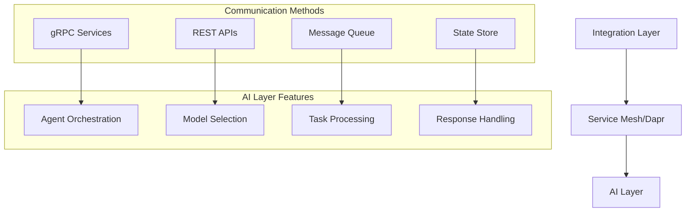

# Implementation Plan for AI-Powered Workflow Automation Platform

[Previous sections remain the same...]

## Integration-AI Layer Communication

### Service Communication Architecture



### gRPC Service Definitions
```protobuf
syntax = "proto3";

service AIAgentService {
    rpc ProcessTask (TaskRequest) returns (TaskResponse);
    rpc StreamResults (TaskRequest) returns (stream ResultUpdate);
    rpc GetAgentStatus (AgentRequest) returns (AgentStatus);
}

message TaskRequest {
    string task_id = 1;
    string agent_type = 2;
    bytes payload = 3;
    map<string, string> metadata = 4;
}

message TaskResponse {
    string task_id = 1;
    string status = 2;
    bytes result = 3;
    repeated Error errors = 4;
}
```

### Event-Driven Integration
```yaml
dapr:
  pubsub:
    name: ai-events
    topics:
      - name: task-events
        routes:
          - match: /ai/task/*
            path: /process
      - name: agent-events
        routes:
          - match: /ai/agent/*
            path: /status

  state:
    name: workflow-state
    options:
      actorStateStore: true
      consistency: strong
```

### Message Queue Configuration
```yaml
messaging:
  rabbitmq:
    exchanges:
      - name: ai-tasks
        type: direct
        queues:
          - name: research-tasks
            routing_key: research
          - name: analysis-tasks
            routing_key: analysis
          - name: implementation-tasks
            routing_key: implementation
    retry:
      max_attempts: 3
      initial_interval: 1000
      multiplier: 2.0
```

### API Endpoints
```yaml
api:
  ai_service:
    base_url: /api/v1/ai
    endpoints:
      - path: /process
        method: POST
        auth: required
        rate_limit: 100/minute
      - path: /status
        method: GET
        auth: required
        cache: 60s
```

### Integration Error Handling
```typescript
interface ErrorResponse {
  error_code: string;
  message: string;
  details: Record<string, any>;
  retry_after?: number;
}

enum ErrorCodes {
  AGENT_UNAVAILABLE = 'AGENT_UNAVAILABLE',
  MODEL_ERROR = 'MODEL_ERROR',
  RATE_LIMIT_EXCEEDED = 'RATE_LIMIT_EXCEEDED',
  INVALID_REQUEST = 'INVALID_REQUEST'
}
```

### State Management
```typescript
interface WorkflowState {
  workflow_id: string;
  current_stage: string;
  ai_responses: Array<{
    agent_type: string;
    response: any;
    timestamp: Date;
  }>;
  metadata: Record<string, any>;
}
```

### Performance Optimization
```yaml
optimization:
  caching:
    enabled: true
    ttl: 300
    strategy: least-recently-used
  batching:
    enabled: true
    max_size: 10
    timeout: 100ms
  connection_pooling:
    min_size: 5
    max_size: 20
    idle_timeout: 60s
```

[Previous sections remain the same...]
