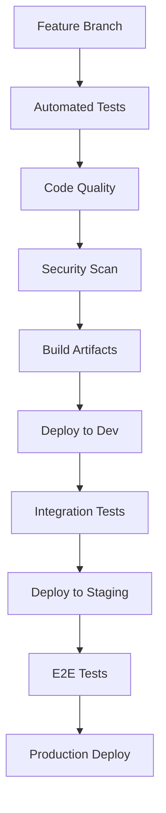

# Technical Implementation Guide

For detailed system interaction flows and sequence diagrams, see [applicationFlow.md](applicationFlow.md).

## Table of Contents
1. [Development Setup](#development-setup)
2. [Component Implementation](#component-implementation)
3. [Infrastructure Setup](#infrastructure-setup)
4. [Testing Strategy](#testing-strategy)
5. [Deployment](#deployment)
6. [Monitoring](#monitoring)

## Development Setup

### Required Versions
```bash
node: 22.x
python: 3.12.2
docker: 25.0.2
docker-compose: 2.33.0
dapr: 1.14
```

### Development Workflow
1. **Branch Strategy**
   - `main`: Production-ready code
   - `develop`: Integration branch
   - `feature/*`: New features
   - `bugfix/*`: Bug fixes
   - `release/*`: Release preparation

2. **Code Standards**
   - ESLint + Prettier for JavaScript/TypeScript
   - Black + isort for Python
   - Pre-commit hooks for formatting
   - Conventional commits format

3. **Documentation Requirements**
   - OpenAPI/Swagger for REST APIs
   - Protocol buffers for gRPC services
   - JSDoc for JavaScript/TypeScript
   - Type hints for Python
   - Architecture Decision Records (ADRs)

### CI/CD Pipeline


## Component Implementation

### Frontend Implementation
```typescript
// Component structure
src/
  ├── components/
  │   ├── workflow/
  │   │   ├── Builder.tsx
  │   │   ├── Canvas.tsx
  │   │   └── NodeTypes.tsx
  │   ├── agents/
  │   │   ├── AgentCard.tsx
  │   │   └── AgentConfig.tsx
  │   └── common/
  ├── services/
  │   ├── api.ts
  │   ├── websocket.ts
  │   └── state.ts
  └── utils/

// State Management
interface WorkflowState {
  nodes: Node[];
  edges: Edge[];
  agents: Agent[];
  selectedNode: string | null;
  running: boolean;
}

const workflowSlice = createSlice({
  name: 'workflow',
  initialState,
  reducers: {
    addNode: (state, action) => {},
    updateEdge: (state, action) => {},
    setRunning: (state, action) => {}
  }
});

// WebSocket Service
class WebSocketService {
  private socket: Socket;
  
  constructor() {
    this.socket = io({
      path: '/ws',
      transports: ['websocket'],
      auth: { token: getAuthToken() }
    });
  }

  subscribeToAgentUpdates(workflowId: string) {
    this.socket.emit('subscribe', { workflowId });
    this.socket.on('agent:update', (data) => {
      store.dispatch(updateAgentStatus(data));
    });
  }
}
```

### Backend Services

#### Kong Gateway Configuration
```yaml
services:
  - name: workflow-service
    url: http://workflow-service:8000
    routes:
      - name: workflow-api
        paths: ["/api/v1/workflows"]
        strip_path: true
    plugins:
      - name: key-auth
      - name: rate-limiting
        config:
          second: 5
          hour: 10000

  - name: ai-service
    url: http://ai-service:9000
    routes:
      - name: ai-api
        paths: ["/api/v1/ai"]
    plugins:
      - name: jwt
      - name: cors
```

#### Security and Compliance Services

```typescript
/**
 * Interface for handling HIPAA-compliant data encryption
 */
interface EncryptionService {
  encryptData(data: Buffer): Promise<{ encrypted: Buffer; iv: Buffer }>;
  decryptData(encrypted: Buffer, iv: Buffer): Promise<Buffer>;
  hashSensitiveData(data: string): Promise<string>;
}

/**
 * Interface for GDPR compliance operations
 */
interface GDPRService {
  validateConsent(userId: string, purpose: string[]): Promise<boolean>;
  handleDataRequest(userId: string, requestType: 'access' | 'delete' | 'export'): Promise<void>;
  logDataProcessing(userId: string, purpose: string, data: any): Promise<void>;
}

/**
 * Interface for audit logging
 */
interface AuditService {
  logAccess(userId: string, resourceId: string, action: string): Promise<void>;
  logDataModification(userId: string, resourceId: string, oldValue: any, newValue: any): Promise<void>;
  generateAuditReport(startDate: Date, endDate: Date): Promise<AuditReport>;
}

/**
 * Base service with security and compliance features
 */
abstract class BaseService {
  protected logger: Logger;
  protected metrics: MetricsClient;
  protected encryption: EncryptionService;
  protected gdpr: GDPRService;
  protected audit: AuditService;

  constructor(
    protected readonly config: ServiceConfig,
    protected readonly dataRegion: string
  ) {
    this.validateDataRegion(dataRegion);
  }
  
  abstract handleRequest(req: Request): Promise<Response>;
  abstract handleError(error: Error): Response;
  
  protected async trace<T>(
    name: string,
    fn: () => Promise<T>,
    userId?: string
  ): Promise<T> {
    const span = tracer.startSpan(name);
    try {
      // Add compliance context
      span.setAttributes({
        'data.region': this.dataRegion,
        'user.id': userId,
        'compliance.level': this.config.complianceLevel
      });

      const result = await fn();
      
      // Audit successful operation
      if (userId) {
        await this.audit.logAccess(userId, name, 'execute');
      }
      
      span.end();
      return result;
    } catch (error) {
      // Log security/compliance errors separately
      if (error instanceof ComplianceError) {
        await this.handleComplianceViolation(error);
      }
      
      span.setStatus(SpanStatus.ERROR);
      span.end();
      throw error;
    }
  }

  protected async processData<T>(data: T, userId: string): Promise<T> {
    // Validate GDPR consent
    const hasConsent = await this.gdpr.validateConsent(userId, ['process', 'store']);
    if (!hasConsent) {
      throw new ComplianceError('Missing required consent');
    }

    // Encrypt sensitive data
    if (this.containsSensitiveData(data)) {
      const { encrypted, iv } = await this.encryption.encryptData(Buffer.from(JSON.stringify(data)));
      return {
        ...data,
        encrypted_data: encrypted,
        encryption_iv: iv
      } as T;
    }

    return data;
  }

  private async handleComplianceViolation(error: ComplianceError): Promise<void> {
    await this.audit.logAccess(error.userId, error.resource, 'violation');
    this.metrics.incrementCounter('compliance_violations', {
      type: error.type,
      region: this.dataRegion
    });
  }

  private validateDataRegion(region: string): void {
    if (!this.config.allowedRegions.includes(region)) {
      throw new ComplianceError('Invalid data region');
    }
  }

  private containsSensitiveData(data: any): boolean {
    // Implement logic to detect PII, PHI, etc.
    return true; // Simplified for example
  }
}
```

### AI Agent Implementation

#### Agent Configuration
```yaml
agents:
  research:
    model: gpt-4
    temperature: 0.7
    max_tokens: 2048
    retry_policy:
      max_retries: 3
      backoff: exponential
    
  analysis:
    model: gpt-4
    temperature: 0.3
    max_tokens: 1024
    
  implementation:
    model: gpt-4
    temperature: 0.2
    max_tokens: 4096
    
  qa:
    model: gpt-3.5-turbo
    temperature: 0.1
    max_tokens: 1024
```

#### CrewAI Integration
```python
from crewai import Agent, Task, Crew
from typing import List

class ResearchAgent(Agent):
    def __init__(self, config: dict):
        super().__init__(
            name="Research",
            goal="Gather and analyze information",
            backstory="Expert at research and data collection",
            allow_delegation=True,
            **config
        )
    
    async def execute(self, task: Task) -> str:
        # Implementation
        pass

class WorkflowCrew:
    def __init__(self, agents: List[Agent]):
        self.crew = Crew(
            agents=agents,
            tasks=[],
            verbose=True
        )
    
    async def process_workflow(self, workflow_data: dict):
        # Implementation
        pass
```

### Data Layer Implementation

#### Database Schema
```sql
-- Enable encryption extension
CREATE EXTENSION IF NOT EXISTS pgcrypto;

-- Core tables with compliance features
CREATE TABLE workflows (
    id UUID PRIMARY KEY,
    name VARCHAR(255) NOT NULL,
    description TEXT,
    created_at TIMESTAMPTZ DEFAULT NOW(),
    updated_at TIMESTAMPTZ DEFAULT NOW(),
    metadata JSONB,
    -- HIPAA & GDPR compliance
    encrypted_data bytea,
    encryption_iv bytea,
    data_classification VARCHAR(50) NOT NULL,
    consent_status JSONB,
    data_retention_date TIMESTAMPTZ,
    -- Audit & Access Control
    created_by UUID NOT NULL,
    last_accessed_by UUID,
    last_accessed_at TIMESTAMPTZ,
    access_history JSONB,
    -- Geographic Controls
    data_region VARCHAR(50) NOT NULL,
    cross_border_allowed BOOLEAN DEFAULT false
);

-- Audit logging
CREATE TABLE audit_logs (
    id UUID PRIMARY KEY DEFAULT gen_random_uuid(),
    event_time TIMESTAMPTZ DEFAULT NOW(),
    user_id UUID NOT NULL,
    action VARCHAR(50) NOT NULL,
    resource_type VARCHAR(50) NOT NULL,
    resource_id UUID NOT NULL,
    old_value JSONB,
    new_value JSONB,
    ip_address INET,
    user_agent TEXT
);

CREATE TABLE workflow_nodes (
    id UUID PRIMARY KEY,
    workflow_id UUID REFERENCES workflows(id),
    type VARCHAR(50) NOT NULL,
    config JSONB,
    position JSONB
);

CREATE TABLE workflow_edges (
    id UUID PRIMARY KEY,
    workflow_id UUID REFERENCES workflows(id),
    source_id UUID REFERENCES workflow_nodes(id),
    target_id UUID REFERENCES workflow_nodes(id),
    config JSONB
);

-- Vector storage
CREATE EXTENSION IF NOT EXISTS vector;

CREATE TABLE embeddings (
    id UUID PRIMARY KEY,
    workflow_id UUID REFERENCES workflows(id),
    content_type VARCHAR(50),
    embedding vector(1536),
    metadata JSONB
);

-- Indexes
CREATE INDEX idx_workflow_nodes_workflow ON workflow_nodes(workflow_id);
CREATE INDEX idx_workflow_edges_workflow ON workflow_edges(workflow_id);
CREATE INDEX idx_embeddings_workflow ON embeddings(workflow_id);
```

#### Redis Configuration
```yaml
redis:
  master:
    persistence:
      enabled: true
      fsync: everysec
    
  replicas:
    - persistence:
        enabled: true
    - persistence:
        enabled: true
  
  sentinel:
    enabled: true
    quorum: 2
  
  config:
    maxmemory: 2gb
    maxmemory-policy: volatile-lru
    notify-keyspace-events: "Ex"
```

### Integration Layer Implementation

#### Protocol Adapters
```typescript
interface ProtocolAdapter {
  connect(): Promise<void>;
  disconnect(): Promise<void>;
  send(data: any): Promise<void>;
  receive(): Promise<any>;
}

class RestAdapter implements ProtocolAdapter {
  constructor(private config: RestConfig) {}
  
  async connect() {
    // Implementation
  }
  
  async send(data: any) {
    // Implementation
  }
}

class GraphQLAdapter implements ProtocolAdapter {
  constructor(private config: GraphQLConfig) {}
  
  async connect() {
    // Implementation
  }
  
  async send(data: any) {
    // Implementation
  }
}
```

#### Data Transformation
```typescript
interface TransformationRule {
  source: string;
  target: string;
  type: 'map' | 'reduce' | 'filter';
  config: Record<string, any>;
}

class DataTransformer {
  constructor(private rules: TransformationRule[]) {}
  
  transform(data: any): any {
    return this.rules.reduce((acc, rule) => {
      switch (rule.type) {
        case 'map':
          return this.applyMap(acc, rule);
        case 'reduce':
          return this.applyReduce(acc, rule);
        case 'filter':
          return this.applyFilter(acc, rule);
        default:
          return acc;
      }
    }, data);
  }
}
```

## Infrastructure Setup

### Kubernetes Configuration
```yaml
apiVersion: apps/v1
kind: Deployment
metadata:
  name: ${service-name}
spec:
  replicas: 3
  strategy:
    type: RollingUpdate
    rollingUpdate:
      maxSurge: 1
      maxUnavailable: 0
  template:
    spec:
      containers:
        - name: ${service-name}
          image: ${image}:${tag}
          ports:
            - containerPort: 8080
          resources:
            requests:
              cpu: 100m
              memory: 128Mi
            limits:
              cpu: 500m
              memory: 512Mi
          livenessProbe:
            httpGet:
              path: /health
              port: 8080
          readinessProbe:
            httpGet:
              path: /ready
              port: 8080
```

### Network Policies
```yaml
apiVersion: networking.k8s.io/v1
kind: NetworkPolicy
metadata:
  name: default-deny-all
spec:
  podSelector: {}
  policyTypes:
    - Ingress
    - Egress

---
apiVersion: networking.k8s.io/v1
kind: NetworkPolicy
metadata:
  name: allow-internal
spec:
  podSelector:
    matchLabels:
      app: workflow-platform
  policyTypes:
    - Ingress
  ingress:
    - from:
        - podSelector:
            matchLabels:
              app: workflow-platform
```

## Testing Strategy

### Testing Framework

#### Unit Testing
```typescript
// Frontend component test
describe('WorkflowBuilder', () => {
  it('should add new node', () => {
    render(<WorkflowBuilder />);
    const addButton = screen.getByText('Add Node');
    fireEvent.click(addButton);
    expect(screen.getByTestId('node-1')).toBeInTheDocument();
  });
});

// Backend service test
describe('WorkflowService', () => {
  it('should create workflow with proper encryption', async () => {
    const service = new WorkflowService();
    const sensitiveData = { name: 'Test Workflow', phi: 'sensitive data' };
    const result = await service.createWorkflow(sensitiveData);
    
    expect(result.id).toBeDefined();
    expect(result.encrypted_data).toBeDefined();
    expect(result.encryption_iv).toBeDefined();
  });

  it('should enforce GDPR consent requirements', async () => {
    const service = new WorkflowService();
    const userId = 'test-user';
    
    // Mock missing consent
    mockGDPRService.validateConsent.mockResolvedValue(false);
    
    await expect(service.createWorkflow({
      name: 'Test Workflow',
      userId
    })).rejects.toThrow('Missing required consent');
  });

  it('should properly audit access attempts', async () => {
    const service = new WorkflowService();
    const userId = 'test-user';
    const resourceId = 'test-workflow';

    await service.accessWorkflow(resourceId, userId);

    expect(mockAuditService.logAccess).toHaveBeenCalledWith(
      userId,
      resourceId,
      'access'
    );
  });
});

// Security test suite
describe('SecurityService', () => {
  it('should encrypt sensitive data', async () => {
    const service = new SecurityService();
    const data = 'sensitive-data';
    
    const { encrypted, iv } = await service.encryptData(Buffer.from(data));
    
    expect(encrypted).not.toEqual(data);
    expect(iv).toBeDefined();
    
    const decrypted = await service.decryptData(encrypted, iv);
    expect(decrypted.toString()).toEqual(data);
  });

  it('should validate data region restrictions', async () => {
    const service = new SecurityService({ allowedRegions: ['us-east'] });
    
    await expect(
      service.validateDataRegion('eu-west')
    ).rejects.toThrow('Invalid data region');
  });
});
```

### Integration Testing
```typescript
describe('Workflow E2E', () => {
  it('should complete workflow execution with proper security controls', async () => {
    // Setup test data with PHI
    const workflow = await createTestWorkflow({
      data: { patientInfo: 'test data' },
      classification: 'PHI',
      region: 'us-east'
    });

    // Verify HIPAA compliance
    expect(workflow.encrypted_data).toBeDefined();
    expect(workflow.data_classification).toBe('PHI');

    // Execute workflow
    const response = await api.post(`/workflows/${workflow.id}/start`);
    expect(response.status).toBe(200);
    
    await waitForWorkflowCompletion(workflow.id);
    
    // Verify results and audit trail
    const result = await api.get(`/workflows/${workflow.id}`);
    expect(result.data.status).toBe('completed');
    
    const auditLogs = await getAuditLogs(workflow.id);
    expect(auditLogs).toContainEntry({
      action: 'workflow_execution',
      resource_type: 'workflow'
    });
  });

  it('should enforce GDPR data transfer restrictions', async () => {
    const euWorkflow = await createTestWorkflow({
      data: { userInfo: 'eu citizen data' },
      region: 'eu-west'
    });

    // Attempt cross-border transfer
    await expect(
      transferWorkflow(euWorkflow.id, 'us-east')
    ).rejects.toThrow('Cross-border transfer not allowed');
  });

  it('should handle data subject rights requests', async () => {
    const userId = 'test-user';
    const workflow = await createTestWorkflow({
      userId,
      data: { personalInfo: 'test data' }
    });

    // Test data export
    const exportedData = await api.post(`/gdpr/export/${userId}`);
    expect(exportedData.data).toContain(workflow.id);

    // Test data deletion
    await api.post(`/gdpr/delete/${userId}`);
    await expect(
      api.get(`/workflows/${workflow.id}`)
    ).rejects.toThrow('Resource not found');
  });
});

// Compliance test suite
describe('Compliance E2E', () => {
  it('should maintain complete audit trail', async () => {
    const workflow = await createTestWorkflow();
    const userId = 'test-user';

    // Perform various operations
    await api.get(`/workflows/${workflow.id}`);
    await api.put(`/workflows/${workflow.id}`, { status: 'updated' });
    await api.delete(`/workflows/${workflow.id}`);

    // Verify audit trail
    const auditLogs = await getAuditLogs(workflow.id);
    expect(auditLogs).toMatchObject([
      { action: 'create', user_id: userId },
      { action: 'read', user_id: userId },
      { action: 'update', user_id: userId },
      { action: 'delete', user_id: userId }
    ]);
  });

  it('should enforce data retention policies', async () => {
    const workflow = await createTestWorkflow({
      retentionDays: 30
    });

    // Fast-forward time in test
    advanceTimeBy('31d');

    // Verify data is automatically removed
    await expect(
      api.get(`/workflows/${workflow.id}`)
    ).rejects.toThrow('Resource expired');
  });
});
```

### Performance and Security Testing
```typescript
import { check, sleep } from 'k6';
import http from 'k6/http';
import { Rate } from 'k6/metrics';

// Custom metrics
const complianceErrors = new Rate('compliance_errors');
const encryptionLatency = new Rate('encryption_latency');
const auditLatency = new Rate('audit_logging_latency');

export const options = {
  scenarios: {
    // Basic load test
    load_test: {
      executor: 'ramping-vus',
      startVUs: 0,
      stages: [
        { duration: '1m', target: 50 },
        { duration: '3m', target: 100 },
        { duration: '1m', target: 0 }
      ]
    },
    // Compliance stress test
    compliance_test: {
      executor: 'constant-vus',
      vus: 10,
      duration: '5m',
      env: { DATA_TYPE: 'PHI' }
    },
    // Security stress test
    security_test: {
      executor: 'per-vu-iterations',
      vus: 5,
      iterations: 100,
      maxDuration: '10m'
    }
  },
  thresholds: {
    http_req_duration: ['p(95)<500'],
    'compliance_errors': ['rate<0.01'],
    'encryption_latency': ['p(95)<100'],
    'audit_logging_latency': ['p(95)<200']
  }
};

// Test data with different classifications
const testData = {
  phi: { patientId: '12345', healthData: 'test data' },
  pii: { userId: '67890', personalData: 'test data' },
  standard: { publicData: 'test data' }
};

// Main test function
export default function() {
  // Health check
  const healthCheck = http.get('http://workflow-platform/health');
  check(healthCheck, {
    'health check ok': (r) => r.status === 200
  });

  // Test PHI data handling
  const phiStart = new Date();
  const phiResponse = http.post('http://workflow-platform/api/v1/workflows', {
    json: testData.phi,
    headers: { 'Content-Type': 'application/json' }
  });
  encryptionLatency.add(new Date() - phiStart);

  check(phiResponse, {
    'phi data encrypted': (r) => r.json('encrypted_data') !== undefined,
    'phi properly classified': (r) => r.json('data_classification') === 'PHI'
  });

  // Test audit logging
  const auditStart = new Date();
  const auditResponse = http.get('http://workflow-platform/api/v1/audit/' + phiResponse.json('id'));
  auditLatency.add(new Date() - auditStart);

  check(auditResponse, {
    'audit log created': (r) => r.status === 200,
    'audit contains access record': (r) => r.json('records').length > 0
  });

  // Test GDPR compliance
  const gdprResponse = http.post('http://workflow-platform/api/v1/workflows', {
    json: testData.pii,
    headers: {
      'Content-Type': 'application/json',
      'X-User-Region': 'EU'
    }
  });

  check(gdprResponse, {
    'gdpr consent verified': (r) => r.json('consent_verified') === true,
    'data region enforced': (r) => r.json('data_region') === 'EU'
  });

  // Security stress test
  if (__ITER % 10 === 0) {  // Every 10th iteration
    const securityChecks = [
      http.get('http://workflow-platform/api/v1/workflows', {
        headers: { 'Authorization': 'Invalid-Token' }
      }),
      http.post('http://workflow-platform/api/v1/workflows', {
        json: { malformed: 'data' }
      }),
      http.put('http://workflow-platform/api/v1/workflows/invalid-id', {
        json: testData.standard
      })
    ];

    securityChecks.forEach(response => {
      check(response, {
        'security controls active': (r) => r.status === 401 || r.status === 403
      });
    });
  }

  sleep(1);  // Prevent overwhelming the system
}

// Teardown function
export function teardown(data) {
  // Cleanup test data
  http.del('http://workflow-platform/api/v1/test-data');
}
```

## Deployment

### Environment Configurations

#### Staging
```yaml
environment: staging
replicas:
  frontend: 2
  backend: 2
  ai-service: 1
resources:
  limits:
    cpu: 1
    memory: 1Gi
monitoring:
  enabled: true
  retention: 7d
```

#### Production
```yaml
environment: production
replicas:
  frontend: 3
  backend: 3
  ai-service: 2
resources:
  limits:
    cpu: 2
    memory: 2Gi
monitoring:
  enabled: true
  retention: 30d
backup:
  enabled: true
  schedule: "0 */6 * * *"
```

### Rollback Procedures
1. Identify failure point
2. Execute rollback command:
   ```bash
   kubectl rollout undo deployment/<service-name>
   ```
3. Verify service health
4. Update monitoring thresholds
5. Document incident

## Monitoring

### Monitoring Rules and Alerts

#### Compliance Monitoring
```yaml
groups:
  - name: compliance-alerts
    rules:
      - alert: HighComplianceViolationRate
        expr: |
          sum(rate(compliance_violations_total[5m])) > 0.001
        for: 5m
        labels:
          severity: critical
          compliance: true
        annotations:
          summary: High rate of compliance violations detected
          description: "Compliance violation rate exceeded threshold"

      - alert: GDPRConsentMissing
        expr: |
          sum(rate(gdpr_consent_failures_total[5m])) > 0
        for: 5m
        labels:
          severity: critical
          compliance: gdpr
        annotations:
          summary: GDPR consent validation failures detected

      - alert: PHIDataExposure
        expr: |
          sum(rate(phi_encryption_failures_total[5m])) > 0
        for: 1m
        labels:
          severity: critical
          compliance: hipaa
        annotations:
          summary: Unencrypted PHI data detected
          
      - alert: AuditLogFailure
        expr: |
          rate(audit_log_failures_total[5m]) > 0
        for: 2m
        labels:
          severity: critical
          compliance: audit
        annotations:
          summary: Audit logging system failures detected
```

#### Security Monitoring
```yaml
groups:
  - name: security-alerts
    rules:
      - alert: HighErrorRate
        expr: |
          sum(rate(http_requests_total{status=~"5.."}[5m])) 
          / 
          sum(rate(http_requests_total[5m])) > 0.01
        for: 5m
        labels:
          severity: critical
        annotations:
          summary: High error rate detected

      - alert: UnauthorizedAccessAttempts
        expr: |
          sum(rate(unauthorized_access_attempts_total[5m])) > 10
        for: 5m
        labels:
          severity: critical
          security: access
        annotations:
          summary: High rate of unauthorized access attempts

      - alert: DataRegionViolation
        expr: |
          sum(rate(data_region_violations_total[5m])) > 0
        for: 1m
        labels:
          severity: critical
          compliance: data-sovereignty
        annotations:
          summary: Data region policy violations detected
```

### Custom Metrics

#### Compliance Metrics
```yaml
compliance_metrics:
  - name: phi_access_total
    type: Counter
    help: "Total PHI data access attempts"
    labels:
      - user_id
      - data_type
      - region
      
  - name: gdpr_consent_status
    type: Gauge
    help: "GDPR consent status by user"
    labels:
      - user_id
      - purpose
      - status
      
  - name: data_retention_status
    type: Gauge
    help: "Data retention compliance status"
    labels:
      - data_type
      - retention_policy
```

#### Security Metrics
```yaml
security_metrics:
  - name: encryption_operations_total
    type: Counter
    help: "Total encryption/decryption operations"
    labels:
      - operation_type
      - data_classification
      
  - name: auth_attempts_total
    type: Counter
    help: "Authentication attempts"
    labels:
      - status
      - auth_type
      - region
      
  - name: audit_log_writes_total
    type: Counter
    help: "Audit log entries created"
    labels:
      - event_type
      - resource_type
```

#### AI and Performance Metrics
```yaml
custom_metrics:
  - name: llm_request_duration
    type: Histogram
    help: "Duration of LLM API requests"
    buckets: [0.1, 0.5, 1, 2, 5]
    
  - name: llm_token_usage
    type: Counter
    help: "Number of tokens used by LLM requests"
    labels:
      - model
      - request_type
      
  - name: agent_execution_time
    type: Histogram
    help: "Time taken for agent task execution"
    buckets: [1, 5, 10, 30, 60]
```

### Database Scaling Strategy

#### Read Replicas
- PostgreSQL streaming replication
- PgBouncer connection pooling
- Read/write splitting

#### Sharding
```sql
-- Sharding by workflow_id
CREATE TABLE workflows_YYYYMM PARTITION OF workflows
FOR VALUES FROM ('YYYY-MM-01') TO ('YYYY-MM-01');
```

#### Caching
```yaml
redis:
  cluster:
    enabled: true
    nodes: 6
  config:
    maxmemory-policy: volatile-lru
    maxmemory: "75%"
```

For architecture overview and standards, see [layers.md](layers.md).
