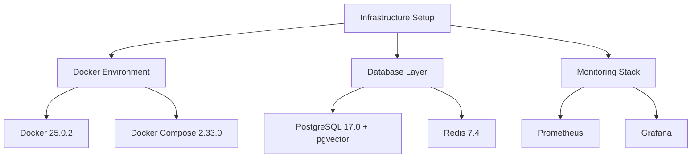
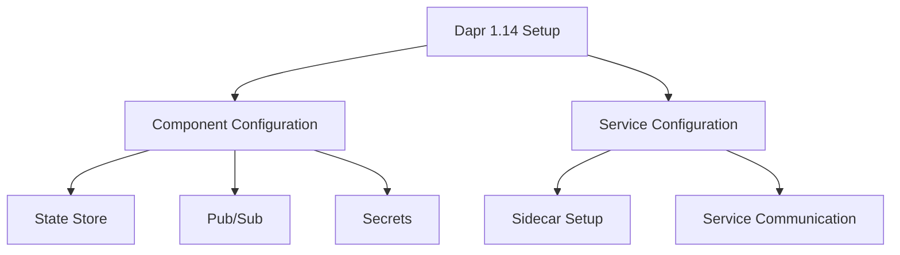
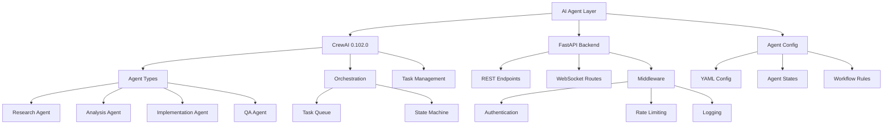
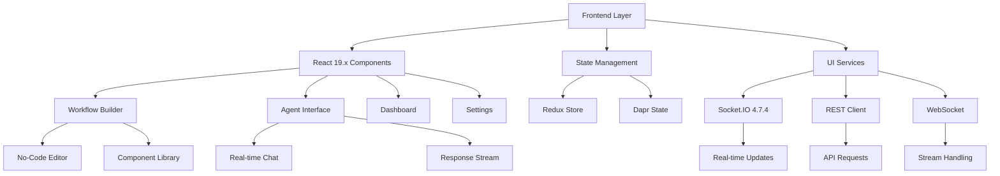
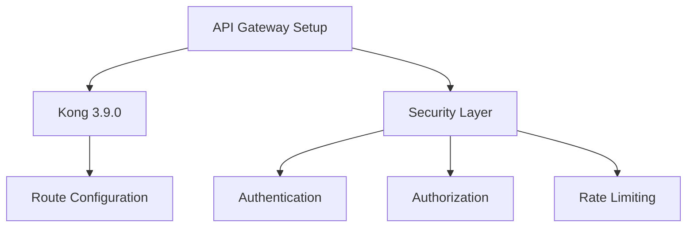
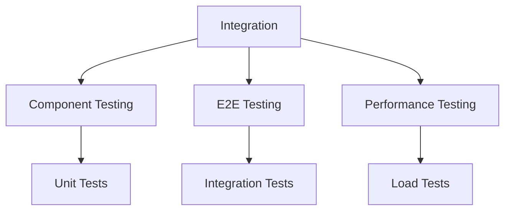
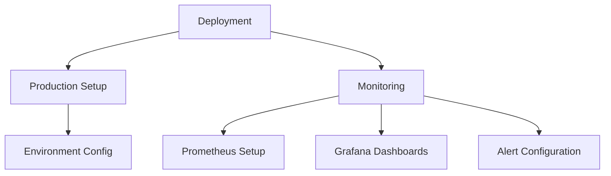

# Implementation Plan for AI-Powered Workflow Automation Platform

## Project Timeline Overview
Total Duration: 9 weeks
Start Date: TBD
Development Approach: Agile with 1-2 week sprints

## Stage 1: Infrastructure Setup (Week 1)

### Tasks and Deliverables
1. Development Environment Setup
   - [ ] Install Docker 25.0.2 and Docker Compose 2.33.0
   - [ ] Configure development tools and IDEs
   - [ ] Set up version control and branching strategy

2. Database Layer Configuration
   - [ ] PostgreSQL 17.0 setup with pgvector extension
   - [ ] Configure vector similarity search
   - [ ] Redis 7.4 configuration
   - [ ] Database backup and recovery procedures
   - [ ] Vector indexing optimization

3. Monitoring Infrastructure
   - [ ] Prometheus configuration
   - [ ] Grafana dashboard setup
   - [ ] Alert rules configuration
   - [ ] Logging pipeline setup

4. Network Configuration
   - [ ] Configure container networking
   - [ ] Set up service discovery
   - [ ] Configure load balancing
   - [ ] Implement network security policies

## Stage 2: Dapr Integration (Week 2)

### Tasks and Deliverables
1. Dapr Installation and Setup
   - [ ] Install Dapr CLI 1.14
   - [ ] Initialize Dapr runtime
   - [ ] Configure Dapr components
   - [ ] Set up development workflows

2. Component Configuration
   - [ ] Configure Redis state store
   - [ ] Set up pub/sub messaging
   - [ ] Implement secrets management
   - [ ] Configure service invocation

3. Integration Testing
   - [ ] Test state management
   - [ ] Verify pub/sub functionality
   - [ ] Validate secrets handling
   - [ ] Test service-to-service communication

## Stage 3: Backend Development (Weeks 3-4)

### Tasks and Deliverables
1. Python Environment Setup
   - [ ] Set up Python 3.12.2
   - [ ] Configure virtual environments
   - [ ] Install dependencies
   - [ ] Set up development tools

2. FastAPI Implementation
   - [ ] Set up FastAPI 0.115.8 structure
   - [ ] Implement REST endpoints
   - [ ] Configure WebSocket routes
   - [ ] Set up middleware components
   - [ ] Add authentication handlers
   - [ ] Configure rate limiting
   - [ ] Implement logging system

3. CrewAI Integration
   - [ ] Set up CrewAI 0.102.0 core
   - [ ] Configure agent types:
     - Research Agent
     - Analysis Agent
     - Implementation Agent
     - QA Agent
   - [ ] Implement orchestration engine
   - [ ] Set up task management system
   - [ ] Configure state machine
   - [ ] Create YAML-based configuration system

4. Testing Framework
   - [ ] Set up pytest
   - [ ] Write unit tests for each agent type
   - [ ] Test orchestration workflows
   - [ ] Validate state management
   - [ ] Test real-time communication
   - [ ] Implement integration tests
   - [ ] Configure CI pipeline

## Stage 4: Frontend Development (Weeks 5-6)

### Tasks and Deliverables
1. Environment Setup
   - [ ] Install Node.js 22.x
   - [ ] Configure npm/yarn
   - [ ] Set up React 19.x and Redux
   - [ ] Set up build tools and optimization

2. UI Development
   - [ ] Create component library
   - [ ] Build workflow editor components
   - [ ] Implement agent interface
   - [ ] Create dashboard components
   - [ ] Add settings interface
   - [ ] Implement responsive design
   - [ ] Create and test themes

3. State Management
   - [ ] Set up Redux store
   - [ ] Implement Dapr state integration
   - [ ] Configure real-time state updates
   - [ ] Add state persistence

4. Real-time Features
   - [ ] Set up Socket.IO 4.7.4
   - [ ] Implement WebSocket connections
   - [ ] Add real-time chat features
   - [ ] Configure response streaming
   - [ ] Implement error handling
   - [ ] Test real-time capabilities

## Stage 5: API Gateway & Security (Week 7)

### Tasks and Deliverables
1. Kong Setup
   - [ ] Install Kong 3.9.0
   - [ ] Configure routes
   - [ ] Set up services
   - [ ] Implement plugins

2. Security Implementation
   - [ ] Set up authentication
   - [ ] Configure authorization
   - [ ] Implement rate limiting
   - [ ] Add API key management

3. Security Testing
   - [ ] Perform security audit
   - [ ] Test rate limiting
   - [ ] Validate authentication
   - [ ] Check authorization

## Stage 6: Integration & Testing (Week 8)

### Tasks and Deliverables
1. Integration Testing
   - [ ] Component integration tests
   - [ ] End-to-end testing
   - [ ] System integration tests
   - [ ] API testing

2. Performance Testing
   - [ ] Load testing
   - [ ] Stress testing
   - [ ] Performance benchmarking
   - [ ] Optimization

3. Documentation
   - [ ] API documentation
   - [ ] System architecture docs
   - [ ] Deployment guides
   - [ ] User manuals

## Stage 7: Deployment & Monitoring (Week 9)

### Tasks and Deliverables
1. Production Setup
   - [ ] Configure production environment
   - [ ] Set up CI/CD pipelines
   - [ ] Configure auto-scaling
   - [ ] Implement backup strategies

2. Monitoring Setup
   - [ ] Configure Prometheus metrics
   - [ ] Set up Grafana dashboards
   - [ ] Implement alerting
   - [ ] Set up log aggregation

3. Final Steps
   - [ ] System documentation
   - [ ] Team training
   - [ ] Handover documentation
   - [ ] Go-live checklist

## Dependencies and Requirements

### Infrastructure
- Docker 25.0.2
- Docker Compose 2.33.0
- Kubernetes (optional)

### Backend
- Python 3.12.2
- FastAPI 0.115.8
- CrewAI 0.102.0
- Pydantic 2.10.0

### Frontend
- Node.js 22.x
- React 19.x
- Socket.IO 4.7.4

### Databases
- PostgreSQL 17.0 with pgvector extension
- Redis 7.4

### API Gateway & Security
- Kong 3.9.0
- JWT authentication
- OAuth2 support

### Monitoring
- Prometheus
- Grafana
- ELK Stack (optional)

## Risk Mitigation

1. Technical Risks
   - Version compatibility issues
   - Performance bottlenecks
   - Integration challenges

2. Mitigation Strategies
   - Comprehensive testing
   - Regular backups
   - Fallback plans
   - Documentation

3. Contingency Plans
   - Version rollback procedures
   - Disaster recovery plans
   - Emergency response protocols

## Success Criteria

1. Performance Metrics
   - Response times < 200ms
   - 99.9% uptime
   - Successful CI/CD pipeline

2. Quality Metrics
   - Test coverage > 80%
   - Zero critical security issues
   - All documentation complete

3. Business Metrics
   - System scalability verified
   - All features functional
   - User acceptance criteria met
