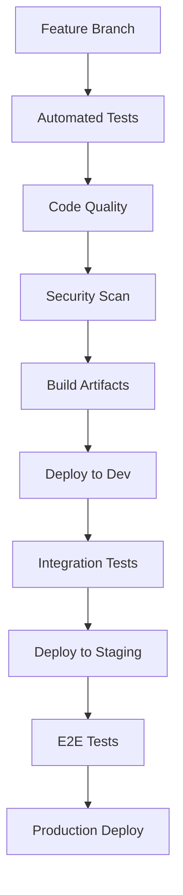

# Technical Implementation Guide

## Table of Contents
1. [Development Setup](#development-setup)
2. [Component Implementation](#component-implementation)
3. [Infrastructure Setup](#infrastructure-setup)
4. [Testing Strategy](#testing-strategy)
5. [Deployment](#deployment)
6. [Monitoring](#monitoring)

## Development Setup

### Required Versions
```bash
node: 22.x
python: 3.12.2
docker: 25.0.2
docker-compose: 2.33.0
dapr: 1.14
```

### Development Workflow
1. **Branch Strategy**
   - `main`: Production-ready code
   - `develop`: Integration branch
   - `feature/*`: New features
   - `bugfix/*`: Bug fixes
   - `release/*`: Release preparation

2. **Code Standards**
   - ESLint + Prettier for JavaScript/TypeScript
   - Black + isort for Python
   - Pre-commit hooks for formatting
   - Conventional commits format

3. **Documentation Requirements**
   - OpenAPI/Swagger for REST APIs
   - Protocol buffers for gRPC services
   - JSDoc for JavaScript/TypeScript
   - Type hints for Python
   - Architecture Decision Records (ADRs)

### CI/CD Pipeline


## Component Implementation

### Frontend Implementation
```typescript
// Component structure
src/
  ├── components/
  │   ├── workflow/
  │   │   ├── Builder.tsx
  │   │   ├── Canvas.tsx
  │   │   └── NodeTypes.tsx
  │   ├── agents/
  │   │   ├── AgentCard.tsx
  │   │   └── AgentConfig.tsx
  │   └── common/
  ├── services/
  │   ├── api.ts
  │   ├── websocket.ts
  │   └── state.ts
  └── utils/

// State Management
interface WorkflowState {
  nodes: Node[];
  edges: Edge[];
  agents: Agent[];
  selectedNode: string | null;
  running: boolean;
}

const workflowSlice = createSlice({
  name: 'workflow',
  initialState,
  reducers: {
    addNode: (state, action) => {},
    updateEdge: (state, action) => {},
    setRunning: (state, action) => {}
  }
});

// WebSocket Service
class WebSocketService {
  private socket: Socket;
  
  constructor() {
    this.socket = io({
      path: '/ws',
      transports: ['websocket'],
      auth: { token: getAuthToken() }
    });
  }

  subscribeToAgentUpdates(workflowId: string) {
    this.socket.emit('subscribe', { workflowId });
    this.socket.on('agent:update', (data) => {
      store.dispatch(updateAgentStatus(data));
    });
  }
}
```

### Backend Services

#### Kong Gateway Configuration
```yaml
services:
  - name: workflow-service
    url: http://workflow-service:8000
    routes:
      - name: workflow-api
        paths: ["/api/v1/workflows"]
        strip_path: true
    plugins:
      - name: key-auth
      - name: rate-limiting
        config:
          second: 5
          hour: 10000

  - name: ai-service
    url: http://ai-service:9000
    routes:
      - name: ai-api
        paths: ["/api/v1/ai"]
    plugins:
      - name: jwt
      - name: cors
```

#### Service Base Class
```typescript
abstract class BaseService {
  protected logger: Logger;
  protected metrics: MetricsClient;
  
  abstract handleRequest(req: Request): Promise<Response>;
  abstract handleError(error: Error): Response;
  
  protected async trace<T>(
    name: string,
    fn: () => Promise<T>
  ): Promise<T> {
    const span = tracer.startSpan(name);
    try {
      const result = await fn();
      span.end();
      return result;
    } catch (error) {
      span.setStatus(SpanStatus.ERROR);
      span.end();
      throw error;
    }
  }
}
```

### AI Agent Implementation

#### Agent Configuration
```yaml
agents:
  research:
    model: gpt-4
    temperature: 0.7
    max_tokens: 2048
    retry_policy:
      max_retries: 3
      backoff: exponential
    
  analysis:
    model: gpt-4
    temperature: 0.3
    max_tokens: 1024
    
  implementation:
    model: gpt-4
    temperature: 0.2
    max_tokens: 4096
    
  qa:
    model: gpt-3.5-turbo
    temperature: 0.1
    max_tokens: 1024
```

#### CrewAI Integration
```python
from crewai import Agent, Task, Crew
from typing import List

class ResearchAgent(Agent):
    def __init__(self, config: dict):
        super().__init__(
            name="Research",
            goal="Gather and analyze information",
            backstory="Expert at research and data collection",
            allow_delegation=True,
            **config
        )
    
    async def execute(self, task: Task) -> str:
        # Implementation
        pass

class WorkflowCrew:
    def __init__(self, agents: List[Agent]):
        self.crew = Crew(
            agents=agents,
            tasks=[],
            verbose=True
        )
    
    async def process_workflow(self, workflow_data: dict):
        # Implementation
        pass
```

### Data Layer Implementation

#### Database Schema
```sql
-- Core tables
CREATE TABLE workflows (
    id UUID PRIMARY KEY,
    name VARCHAR(255) NOT NULL,
    description TEXT,
    created_at TIMESTAMPTZ DEFAULT NOW(),
    updated_at TIMESTAMPTZ DEFAULT NOW(),
    metadata JSONB
);

CREATE TABLE workflow_nodes (
    id UUID PRIMARY KEY,
    workflow_id UUID REFERENCES workflows(id),
    type VARCHAR(50) NOT NULL,
    config JSONB,
    position JSONB
);

CREATE TABLE workflow_edges (
    id UUID PRIMARY KEY,
    workflow_id UUID REFERENCES workflows(id),
    source_id UUID REFERENCES workflow_nodes(id),
    target_id UUID REFERENCES workflow_nodes(id),
    config JSONB
);

-- Vector storage
CREATE EXTENSION IF NOT EXISTS vector;

CREATE TABLE embeddings (
    id UUID PRIMARY KEY,
    workflow_id UUID REFERENCES workflows(id),
    content_type VARCHAR(50),
    embedding vector(1536),
    metadata JSONB
);

-- Indexes
CREATE INDEX idx_workflow_nodes_workflow ON workflow_nodes(workflow_id);
CREATE INDEX idx_workflow_edges_workflow ON workflow_edges(workflow_id);
CREATE INDEX idx_embeddings_workflow ON embeddings(workflow_id);
```

#### Redis Configuration
```yaml
redis:
  master:
    persistence:
      enabled: true
      fsync: everysec
    
  replicas:
    - persistence:
        enabled: true
    - persistence:
        enabled: true
  
  sentinel:
    enabled: true
    quorum: 2
  
  config:
    maxmemory: 2gb
    maxmemory-policy: volatile-lru
    notify-keyspace-events: "Ex"
```

### Integration Layer Implementation

#### Protocol Adapters
```typescript
interface ProtocolAdapter {
  connect(): Promise<void>;
  disconnect(): Promise<void>;
  send(data: any): Promise<void>;
  receive(): Promise<any>;
}

class RestAdapter implements ProtocolAdapter {
  constructor(private config: RestConfig) {}
  
  async connect() {
    // Implementation
  }
  
  async send(data: any) {
    // Implementation
  }
}

class GraphQLAdapter implements ProtocolAdapter {
  constructor(private config: GraphQLConfig) {}
  
  async connect() {
    // Implementation
  }
  
  async send(data: any) {
    // Implementation
  }
}
```

#### Data Transformation
```typescript
interface TransformationRule {
  source: string;
  target: string;
  type: 'map' | 'reduce' | 'filter';
  config: Record<string, any>;
}

class DataTransformer {
  constructor(private rules: TransformationRule[]) {}
  
  transform(data: any): any {
    return this.rules.reduce((acc, rule) => {
      switch (rule.type) {
        case 'map':
          return this.applyMap(acc, rule);
        case 'reduce':
          return this.applyReduce(acc, rule);
        case 'filter':
          return this.applyFilter(acc, rule);
        default:
          return acc;
      }
    }, data);
  }
}
```

## Infrastructure Setup

### Kubernetes Configuration
```yaml
apiVersion: apps/v1
kind: Deployment
metadata:
  name: ${service-name}
spec:
  replicas: 3
  strategy:
    type: RollingUpdate
    rollingUpdate:
      maxSurge: 1
      maxUnavailable: 0
  template:
    spec:
      containers:
        - name: ${service-name}
          image: ${image}:${tag}
          ports:
            - containerPort: 8080
          resources:
            requests:
              cpu: 100m
              memory: 128Mi
            limits:
              cpu: 500m
              memory: 512Mi
          livenessProbe:
            httpGet:
              path: /health
              port: 8080
          readinessProbe:
            httpGet:
              path: /ready
              port: 8080
```

### Network Policies
```yaml
apiVersion: networking.k8s.io/v1
kind: NetworkPolicy
metadata:
  name: default-deny-all
spec:
  podSelector: {}
  policyTypes:
    - Ingress
    - Egress

---
apiVersion: networking.k8s.io/v1
kind: NetworkPolicy
metadata:
  name: allow-internal
spec:
  podSelector:
    matchLabels:
      app: workflow-platform
  policyTypes:
    - Ingress
  ingress:
    - from:
        - podSelector:
            matchLabels:
              app: workflow-platform
```

## Testing Strategy

### Unit Testing
```typescript
// Frontend component test
describe('WorkflowBuilder', () => {
  it('should add new node', () => {
    render(<WorkflowBuilder />);
    const addButton = screen.getByText('Add Node');
    fireEvent.click(addButton);
    expect(screen.getByTestId('node-1')).toBeInTheDocument();
  });
});

// Backend service test
describe('WorkflowService', () => {
  it('should create workflow', async () => {
    const service = new WorkflowService();
    const result = await service.createWorkflow({
      name: 'Test Workflow',
      nodes: []
    });
    expect(result.id).toBeDefined();
  });
});
```

### Integration Testing
```typescript
describe('Workflow E2E', () => {
  it('should complete workflow execution', async () => {
    const workflow = await createTestWorkflow();
    const response = await api.post(`/workflows/${workflow.id}/start`);
    expect(response.status).toBe(200);
    await waitForWorkflowCompletion(workflow.id);
    const result = await api.get(`/workflows/${workflow.id}`);
    expect(result.data.status).toBe('completed');
  });
});
```

### Performance Testing
```typescript
import { check } from 'k6';
import http from 'k6/http';

export const options = {
  stages: [
    { duration: '1m', target: 50 },
    { duration: '3m', target: 100 },
    { duration: '1m', target: 0 }
  ],
  thresholds: {
    http_req_duration: ['p(95)<500']
  }
};

export default function() {
  const res = http.get('http://workflow-platform/api/v1/health');
  check(res, {
    'status is 200': (r) => r.status === 200
  });
}
```

## Deployment

### Environment Configurations

#### Staging
```yaml
environment: staging
replicas:
  frontend: 2
  backend: 2
  ai-service: 1
resources:
  limits:
    cpu: 1
    memory: 1Gi
monitoring:
  enabled: true
  retention: 7d
```

#### Production
```yaml
environment: production
replicas:
  frontend: 3
  backend: 3
  ai-service: 2
resources:
  limits:
    cpu: 2
    memory: 2Gi
monitoring:
  enabled: true
  retention: 30d
backup:
  enabled: true
  schedule: "0 */6 * * *"
```

### Rollback Procedures
1. Identify failure point
2. Execute rollback command:
   ```bash
   kubectl rollout undo deployment/<service-name>
   ```
3. Verify service health
4. Update monitoring thresholds
5. Document incident

## Monitoring

### Prometheus Rules
```yaml
groups:
  - name: workflow-platform
    rules:
      - alert: HighErrorRate
        expr: |
          sum(rate(http_requests_total{status=~"5.."}[5m])) 
          / 
          sum(rate(http_requests_total[5m])) > 0.01
        for: 5m
        labels:
          severity: critical
        annotations:
          summary: High error rate detected
          
      - alert: SlowResponses
        expr: |
          histogram_quantile(0.95, sum(rate(http_request_duration_seconds_bucket[5m])) by (le)) > 2
        for: 5m
        labels:
          severity: warning
```

### Custom AI Metrics
```yaml
custom_metrics:
  - name: llm_request_duration
    type: Histogram
    help: "Duration of LLM API requests"
    buckets: [0.1, 0.5, 1, 2, 5]
    
  - name: llm_token_usage
    type: Counter
    help: "Number of tokens used by LLM requests"
    labels:
      - model
      - request_type
      
  - name: agent_execution_time
    type: Histogram
    help: "Time taken for agent task execution"
    buckets: [1, 5, 10, 30, 60]
```

### Database Scaling Strategy

#### Read Replicas
- PostgreSQL streaming replication
- PgBouncer connection pooling
- Read/write splitting

#### Sharding
```sql
-- Sharding by workflow_id
CREATE TABLE workflows_YYYYMM PARTITION OF workflows
FOR VALUES FROM ('YYYY-MM-01') TO ('YYYY-MM-01');
```

#### Caching
```yaml
redis:
  cluster:
    enabled: true
    nodes: 6
  config:
    maxmemory-policy: volatile-lru
    maxmemory: "75%"
```

For architecture overview and standards, see [layers.md](layers.md).
