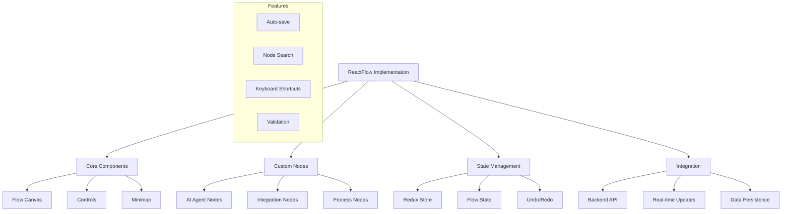

# Implementation Plan for AI-Powered Workflow Automation Platform

[Previous sections remain the same up to Stage 4...]

## Stage 4: No-Code Workflow UI Implementation (Weeks 4-5)



### Tasks and Deliverables

1. ReactFlow Setup (Week 4, Days 1-2)
   - [ ] Install ReactFlow 12.4.3 and dependencies:
     ```bash
     npm install reactflow@12.4.3
     npm install @reactflow/node-resizer@2.1.0
     npm install @reactflow/background@11.0.9
     npm install @reactflow/controls@11.1.9
     npm install @reactflow/minimap@11.1.9
     ```
   - [ ] Configure flow canvas:
     * Set up workspace dimensions
     * Configure zoom levels
     * Implement snap-to-grid
     * Set up node boundaries
   - [ ] Set up basic controls:
     * Zoom controls
     * Fit view
     * Lock mechanism
   - [ ] Implement minimap:
     * Configure size and position
     * Style node representations
     * Add mask area
   - [ ] Configure background:
     * Grid pattern
     * Dots vs lines option
     * Custom styling

2. Custom Node Development (Week 4, Days 3-5)
   - [ ] Create AI agent node types:
     * Research agent node with configuration
     * Analysis agent node with data inputs
     * Implementation agent node with actions
     * QA agent node with validation rules
   - [ ] Build integration nodes:
     * CRM connector nodes with credentials
     * Database operation nodes with queries
     * API endpoint nodes with methods
     * File system nodes with paths
   - [ ] Process flow nodes:
     * Decision nodes with conditions
     * Transform nodes with mappings
     * Validation nodes with rules
     * Error handling nodes with recovery
   - [ ] Node features:
     * Custom styling
     * Input/output ports
     * Validation indicators
     * Loading states

3. State Management (Week 4, Day 6 - Week 5, Day 2)
   - [ ] Set up Redux flow state:
     * Node positions
     * Edge connections
     * Selection state
     * Workflow metadata
   - [ ] Implement undo/redo system:
     * Action history
     * State snapshots
     * Batch operations
   - [ ] Configure state persistence:
     * Auto-save
     * Local storage backup
     * Server synchronization
   - [ ] Add flow validation:
     * Connection rules
     * Required fields
     * Cycle detection
     * Type checking
   - [ ] Implement error handling:
     * Validation errors
     * Runtime errors
     * Recovery options

4. Properties Panel (Week 5, Days 3-4)
   - [ ] Create node configuration panel:
     * Dynamic form generation
     * Type-specific inputs
     * Validation rules
   - [ ] Build form components:
     * Input fields
     * Select dropdowns
     * Credential inputs
     * Code editors
   - [ ] Add validation rules:
     * Required fields
     * Type checking
     * Custom validation
   - [ ] Implement data mapping:
     * Input/output mapping
     * Transform functions
     * Variable references
   - [ ] Style customization:
     * Node colors
     * Border styles
     * Icon selection
     * Label positioning

5. Integration Features (Week 5, Days 5-7)
   - [ ] Backend API integration:
     * Save/load workflows
     * Execute workflows
     * Fetch node configurations
   - [ ] Real-time updates:
     * Collaboration cursors
     * Live node updates
     * Status indicators
   - [ ] Flow export/import:
     * JSON format
     * Version compatibility
     * Validation checks
   - [ ] Version control:
     * Workflow versions
     * Changelogs
     * Rollback capability
   - [ ] Collaboration features:
     * Multi-user editing
     * Change notifications
     * Conflict resolution

6. Testing Strategy
   - [ ] Unit tests:
     * Node components
     * State management
     * Validation rules
   - [ ] Integration tests:
     * Flow operations
     * State persistence
     * API integration
   - [ ] End-to-end tests:
     * Workflow creation
     * Execution flows
     * Error scenarios
   - [ ] Performance testing:
     * Large workflow handling
     * Real-time updates
     * State management
   - [ ] User acceptance testing:
     * Usability tests
     * Feature validation
     * Edge cases

### Updated Dependencies and Requirements

Frontend Dependencies:
```json
{
  "dependencies": {
    "react": "^19.0.0",
    "reactflow": "^12.4.3",
    "@reactflow/node-resizer": "^2.1.0",
    "@reactflow/background": "^11.0.9",
    "@reactflow/controls": "^11.1.9",
    "@reactflow/minimap": "^11.1.9",
    "socket.io-client": "^4.7.4",
    "@reduxjs/toolkit": "^2.0.0",
    "react-redux": "^9.0.0",
    "@monaco-editor/react": "^4.6.0",
    "lodash": "^4.17.21",
    "yup": "^1.3.3"
  },
  "devDependencies": {
    "@testing-library/react": "^14.1.2",
    "@testing-library/user-event": "^14.5.1",
    "jest": "^29.7.0",
    "cypress": "^13.6.2"
  }
}
```

[Rest of the implementation plan remains the same...]

## Risk Mitigation

Add to Technical Risks:
- ReactFlow performance with large workflows
- Real-time collaboration conflicts
- Browser compatibility issues
- State management complexity

Add to Mitigation Strategies:
- Workflow size limits
- Conflict resolution mechanisms
- Browser testing matrix
- State optimization techniques

## Success Criteria

Add to Performance Metrics:
- Workflow render time < 500ms
- Real-time update latency < 100ms
- Undo/redo operations < 50ms

Add to Quality Metrics:
- UI component test coverage > 90%
- Zero console errors
- All keyboard shortcuts functional
- Cross-browser compatibility
