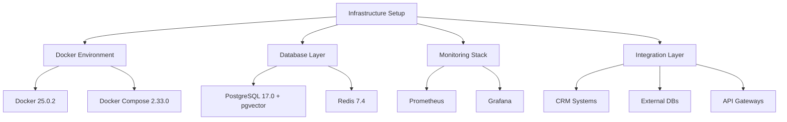
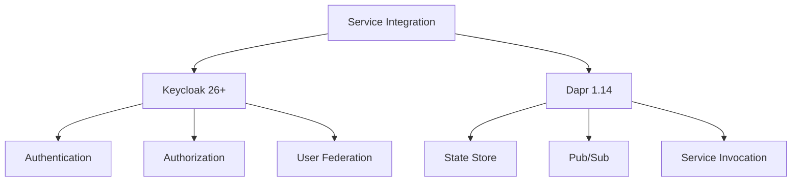
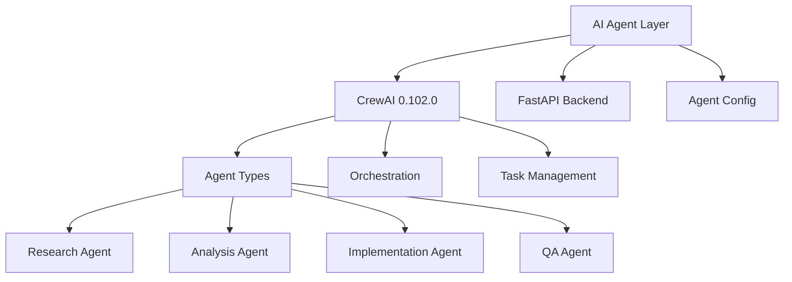
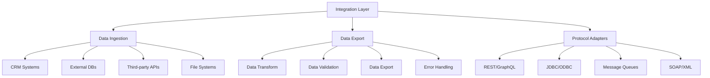
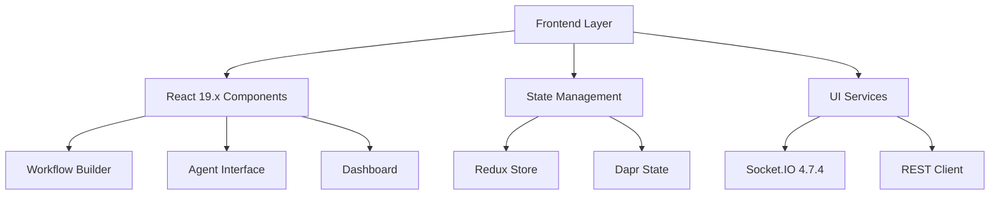
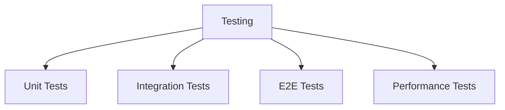
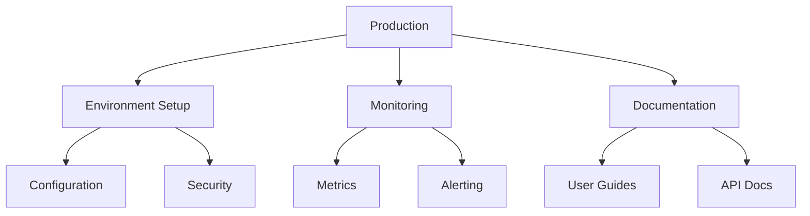

# Implementation Plan for AI-Powered Workflow Automation Platform

## Project Timeline Overview
Total Duration: 9 weeks
Start Date: TBD
Development Approach: Agile with 1-2 week sprints

## Stage 1: Infrastructure Setup (Week 1)

### Tasks and Deliverables
1. Development Environment Setup
   - [ ] Install Docker 25.0.2 and Docker Compose 2.33.0
   - [ ] Configure development tools and IDEs
   - [ ] Set up version control and branching strategy

2. Integration Layer Setup
   - [ ] Configure CRM connectors:
     * Salesforce integration
     * Dynamics 365 setup
     * HubSpot integration
   - [ ] Database connectors:
     * Oracle client setup
     * MySQL connector
     * MongoDB driver
   - [ ] Protocol adapters:
     * REST/GraphQL gateway
     * JDBC/ODBC bridges
     * Message queue setup
   - [ ] File system connectors:
     * S3 configuration
     * SFTP server setup

3. Database Layer Configuration
   - [ ] PostgreSQL 17.0 setup with pgvector extension
   - [ ] Configure vector similarity search
   - [ ] Redis 7.4 configuration
   - [ ] Database backup and recovery procedures
   - [ ] Vector indexing optimization

4. Monitoring Infrastructure
   - [ ] Prometheus configuration
   - [ ] Grafana dashboard setup
   - [ ] Alert rules configuration
   - [ ] Logging pipeline setup

5. Network Configuration
   - [ ] Configure container networking
   - [ ] Set up service discovery
   - [ ] Configure load balancing
   - [ ] Implement network security policies

## Stage 2: Authentication & Dapr Integration (Week 2)

### Tasks and Deliverables
1. Keycloak Setup
   - [ ] Install and configure Keycloak 26+
   - [ ] Set up realm and clients
   - [ ] Configure user roles and permissions
   - [ ] Implement SSO integration

2. Dapr Integration
   - [ ] Install Dapr CLI 1.14
   - [ ] Initialize Dapr runtime
   - [ ] Configure Redis state store
   - [ ] Set up pub/sub messaging
   - [ ] Implement secrets management

3. Security Testing
   - [ ] Test authentication flows
   - [ ] Verify authorization rules
   - [ ] Validate token management
   - [ ] Test service-to-service auth

## Stage 3: Backend Development (Weeks 3-4)

### Tasks and Deliverables
1. FastAPI Implementation
   - [ ] Set up FastAPI 0.115.8 structure
   - [ ] Implement REST endpoints
   - [ ] Configure WebSocket routes
   - [ ] Set up middleware components
   - [ ] Add authentication handlers
   - [ ] Configure rate limiting
   - [ ] Implement logging system

2. CrewAI Integration
   - [ ] Set up CrewAI 0.102.0 core
   - [ ] Configure agent types:
     - Research Agent
     - Analysis Agent
     - Implementation Agent
     - QA Agent
   - [ ] Implement orchestration engine
   - [ ] Set up task management system
   - [ ] Configure state machine
   - [ ] Create YAML-based configuration system

3. Testing Framework
   - [ ] Set up pytest
   - [ ] Write unit tests for each agent type
   - [ ] Test orchestration workflows
   - [ ] Validate state management
   - [ ] Test real-time communication

## Stage 4: Integration Layer Implementation (Weeks 4-5)

### Tasks and Deliverables
1. Data Ingestion Setup
   - [ ] Implement CRM connectors
   - [ ] Configure database adapters
   - [ ] Set up API integration endpoints
   - [ ] Configure file system connectors

2. Data Export Implementation
   - [ ] Create data transformation pipelines
   - [ ] Implement schema validation
   - [ ] Set up error handling and logging
   - [ ] Configure data export formats

3. Protocol Adapter Configuration
   - [ ] Set up REST/GraphQL gateway
   - [ ] Configure JDBC/ODBC connections
   - [ ] Implement message queue integrations
   - [ ] Set up SOAP/XML services

4. Security & Monitoring
   - [ ] Implement API key management
   - [ ] Configure OAuth integration
   - [ ] Set up data encryption
   - [ ] Configure audit logging

## Stage 5: Frontend Development (Weeks 6-7)

### Tasks and Deliverables
1. UI Development
   - [ ] Create component library
   - [ ] Build workflow editor components
   - [ ] Implement agent interface
   - [ ] Create dashboard components
   - [ ] Add settings interface

2. State Management
   - [ ] Set up Redux store
   - [ ] Implement Dapr state integration
   - [ ] Configure real-time state updates
   - [ ] Add state persistence

3. Integration Features
   - [ ] Implement Keycloak authentication
   - [ ] Add external system connectors
   - [ ] Set up real-time updates
   - [ ] Configure WebSocket streams

## Stage 6: Testing & Quality Assurance (Week 8)

### Tasks and Deliverables
1. Test Implementation
   - [ ] Write comprehensive test suites
   - [ ] Set up CI/CD pipelines
   - [ ] Implement automated testing
   - [ ] Create test documentation

2. Integration Testing
   - [ ] Test external system integrations
   - [ ] Validate data flows
   - [ ] Verify security measures
   - [ ] Test failure scenarios

3. Performance Testing
   - [ ] Conduct load testing
   - [ ] Measure response times
   - [ ] Test scalability
   - [ ] Optimize bottlenecks

## Stage 7: Deployment & Monitoring (Week 9)

### Tasks and Deliverables
1. Deployment Setup
   - [ ] Configure production environment
   - [ ] Set up auto-scaling
   - [ ] Implement backup strategies
   - [ ] Configure monitoring

2. Documentation
   - [ ] Create user documentation
   - [ ] Write API documentation
   - [ ] Prepare deployment guides
   - [ ] Document integration points

## Dependencies and Requirements

### Infrastructure
- Docker 25.0.2
- Docker Compose 2.33.0
- Kubernetes (optional)

### Backend
- Python 3.12.2
- FastAPI 0.115.8
- CrewAI 0.102.0
- Pydantic 2.10.0

### Integration
- Salesforce API Client
- Dynamics 365 SDK
- HubSpot Client
- Oracle Client
- MySQL Connector
- MongoDB Driver
- Apache Kafka
- RabbitMQ Client

### Frontend
- Node.js 22.x
- React 19.x
- Socket.IO 4.7.4

### Databases
- PostgreSQL 17.0 with pgvector extension
- Redis 7.4

### API Gateway & Security
- Kong 3.9.0
- Keycloak 26+
- JWT authentication
- OAuth2 support

### Monitoring
- Prometheus
- Grafana
- ELK Stack (optional)

## Risk Mitigation

1. Technical Risks
   - Version compatibility issues
   - Integration system failures
   - Performance bottlenecks
   - Security vulnerabilities

2. Mitigation Strategies
   - Comprehensive testing
   - Regular backups
   - Failover systems
   - Security audits
   - Documentation

3. Contingency Plans
   - Version rollback procedures
   - Backup integration paths
   - Emergency response protocols
   - Incident management procedures

## Success Criteria

1. Performance Metrics
   - Response times < 200ms
   - 99.9% uptime
   - Successful integration tests
   - Passing security audits

2. Quality Metrics
   - Test coverage > 80%
   - Zero critical security issues
   - All documentation complete
   - Integration validation

3. Business Metrics
   - System scalability verified
   - All features functional
   - External system connectivity
   - User acceptance criteria met
