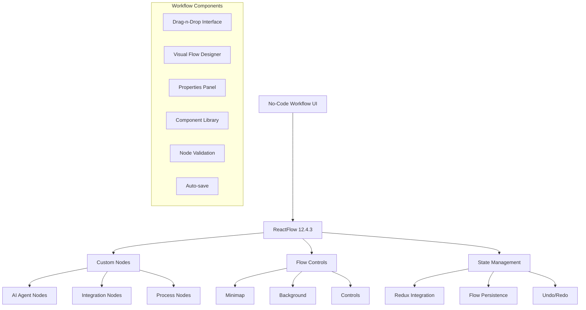

# AI-Powered Workflow Automation Platform

A modular, scalable platform for enterprise workflow automation using AI agents. Built with the latest stable SDKs, libraries, and permissive licensing (MIT/Apache 2.0).

## Key Features

- No-code workflow builder with ReactFlow
- Real-time AI response streaming
- Multi-LLM orchestration
- Enterprise-grade security & compliance
- Distributed application runtime with Dapr

[Previous architecture overview and data architecture sections remain the same...]

### Components

1. **Frontend/UI Layer**
   - Web Interface: React 19.x-based chatbot interface (Port 3001)
   - Node.js 22.x runtime
   - No-Code Workflow UI: ReactFlow 12.4.3
   - API Gateway: Kong 3.9.0 with Konga admin UI
   - Realtime: Socket.IO 4.7.4 token streaming
   - Dapr JS SDK for state management and pub/sub

**No-Code Workflow Features**:
- Visual workflow designer with drag-and-drop interface
- Custom node types:
  * AI agent nodes (Research, Analysis, Implementation, QA)
  * Integration nodes (CRM, Database, API, File System)
  * Process nodes (Decision, Transform, Validation)
- Real-time flow validation and preview
- Component library with pre-built blocks
- Integration with external systems
- State persistence and version control
- Undo/redo functionality
- Real-time collaboration support
- Auto-save and recovery
- Node search and filtering
- Keyboard shortcuts

[Previous AI Agent Layer, Data Layer, and Integration Layer sections remain the same...]

### Dependencies and Requirements

### Frontend
- Node.js 22.x
- React 19.x
- ReactFlow 12.4.3 and components:
  * @reactflow/node-resizer 2.1.0
  * @reactflow/background 11.0.9
  * @reactflow/controls 11.1.9
  * @reactflow/minimap 11.1.9
- Socket.IO 4.7.4
- Redux Toolkit 2.0.0
- React Redux 9.0.0

[Rest of the original content remains the same...]
