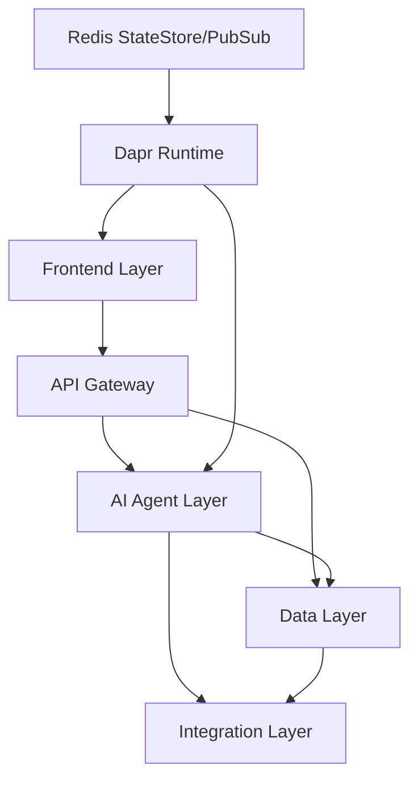

# AI-Powered Workflow Automation Platform

A modular, scalable platform for enterprise workflow automation using AI agents. Built with the latest stable SDKs, libraries, and permissive licensing (MIT/Apache 2.0).

## Key Features

- No-code workflow builder
- Real-time AI response streaming
- Multi-LLM orchestration
- Enterprise-grade security & compliance
- Distributed application runtime with Dapr

## Architecture Overview



### Components

1. **Frontend/UI Layer**
   - Web Interface: React-based chatbot interface (Port 3001)
   - No-Code Builder: Appsmith integration
   - API Gateway: Kong 3.6+ with Konga admin UI
   - Realtime: Socket.IO token streaming
   - Dapr JS SDK for state management and pub/sub

2. **AI Agent Layer**
   - Framework: CrewAI
   - LLMs: GPT-4, OpenAI, or custom models
   - Python FastAPI backend
   - Dynamic LLM switching
   - Dapr Python SDK for service communication

3. **Data Layer**
   - PostgreSQL 16+ with pgvector (Port 5433)
   - Milvus vector database (Port 19530)
   - Redis for Dapr state store and pub/sub (Port 6380)
   - MinIO object storage
   - Etcd for Milvus metadata

4. **Dapr Building Blocks**
   - State Management: Redis-backed state store
   - Pub/Sub Messaging: Redis pub/sub component
   - Service Invocation: Dapr-to-Dapr communication
   - Secrets Management: Local file-based secret store
   - Built-in observability and resilience

## Getting Started

### Prerequisites

- Docker and Docker Compose
- Python 3.11+
- Node.js 18+
- Dapr CLI (for local development)

### Environment Setup

1. Clone the repository:
```bash
git clone https://github.com/your-org/workflow-platform.git
cd workflow-platform
```

2. Configure environment variables:
```bash
# Core database settings
export POSTGRES_USER=dbuser
export POSTGRES_PASSWORD=dbpassword
export POSTGRES_DB=workflow_automation

# Redis settings
export REDIS_PASSWORD=redispassword

# Copy and configure AI agents environment
cd platform/ai_agents
cp .env.example .env
# Edit .env with your OpenAI API key and other configurations
```

3. Start the development environment:
```bash
cd ../
docker-compose up -d
```

4. Access the services:
   - Frontend UI: http://localhost:3001
   - AI Agents API: http://localhost:9000
   - Kong Admin API: http://localhost:8001
   - Konga Dashboard: http://localhost:1337
   - Grafana Dashboard: http://localhost:3000 (admin/admin)
   - Prometheus: http://localhost:9090
   - Milvus: localhost:19530
   - PostgreSQL: localhost:5433
   - Redis: localhost:6380

### Local Development with Dapr

1. Install the Dapr CLI:
```bash
# Windows (PowerShell Admin):
powershell -Command "iwr -useb https://raw.githubusercontent.com/dapr/cli/master/install/install.ps1 | iex"

# Linux/macOS:
wget -q https://raw.githubusercontent.com/dapr/cli/master/install/install.sh -O - | /bin/bash
```

2. Initialize Dapr:
```bash
dapr init
```

3. Run services with Dapr locally:
```bash
# Run AI Agents service
cd platform/ai_agents
dapr run --app-id ai-agents --app-port 8000 --dapr-http-port 3500 python -m uvicorn main:app --host 0.0.0.0 --port 8000

# Run Frontend service
cd ../frontend/workflow-ui
dapr run --app-id workflow-ui --app-port 3000 --dapr-http-port 3501 npm start
```

## Development

### AI Agents Layer

The AI agents layer is built with Python and uses the following key libraries:
- CrewAI for agent orchestration
- LangChain for LLM integration
- FastAPI for API endpoints with Swagger UI documentation
- Pydantic for data validation
- Dapr Python SDK for distributed application features

#### API Documentation

The AI agents service includes comprehensive Swagger UI documentation:

1. Start the service:
```bash
cd platform/ai_agents
uvicorn main:app --reload
```

2. Access the documentation:
- Swagger UI: http://localhost:8000/docs
- ReDoc: http://localhost:8000/redoc

### Dapr Components

The platform uses several Dapr components:

1. **State Store (Redis)**
   - Persistent state management
   - Configuration: `platform/dapr/components/statestore.yaml`
   - Used for storing agent configurations and workflow state

2. **Pub/Sub (Redis)**
   - Event-driven communication
   - Configuration: `platform/dapr/components/pubsub.yaml`
   - Topics:
     - agent-events: Agent creation and updates
     - workflow-events: Workflow execution status

3. **Secrets Management**
   - Local file-based secret store
   - Configuration: `platform/dapr/components/secrets.yaml`
   - Manages sensitive configuration values

### Monitoring

The platform includes comprehensive monitoring with:
- Prometheus for metrics collection
- Grafana for visualization
- Custom dashboards for AI agent metrics
- Dapr observability integration

Access the monitoring stack:
- Grafana: http://localhost:3000 (default credentials: admin/admin)
- Prometheus: http://localhost:9090

## Testing

Run the test suite:

```bash
cd platform/ai_agents
pytest
```

## Contributing

1. Fork the repository
2. Create a feature branch
3. Commit your changes
4. Push to the branch
5. Create a Pull Request

## License

This project is licensed under the MIT License - see the LICENSE file for details.
