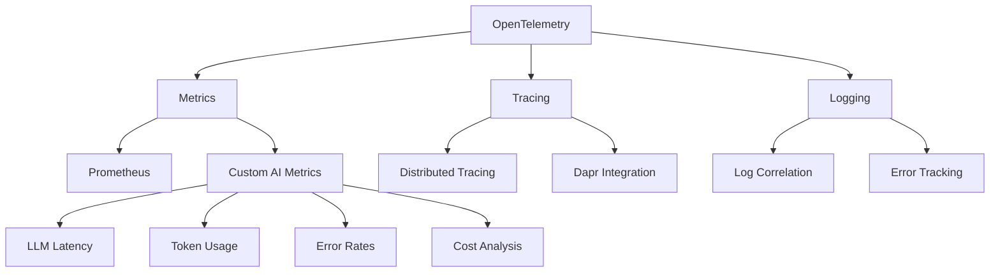

# AI-Powered Workflow Automation Platform

A proprietary, enterprise-grade platform for workflow automation using AI agents. Built with Python 3.12.9 and modern cloud-native technologies.

[Previous sections remain the same up to Monitoring & Observability...]

## Monitoring & Observability

### AI Agent Metrics
- LLM request latency tracking
- Token usage monitoring
- Error rate analysis
- Cost tracking per model/agent
- Response quality metrics

### Grafana Dashboards
1. AI Performance Dashboard
   - Real-time LLM latency graphs
   - Token usage gauges
   - Error rate heatmaps
   - Response time histograms

2. Cost Analysis Dashboard
   - Cost per model breakdown
   - Agent type cost distribution
   - Token usage trends
   - Budget tracking

## Data Security

### Encryption at Rest
- PostgreSQL data encryption (AES-256-GCM)
- Redis data encryption (AES-256-GCM)
- Key rotation policies
- Vault integration for key management

### Environment Configuration
- `.env` based configuration
- Secure secret management
- Environment separation
- Configuration validation

## Testing Framework

### End-to-End Testing
- Workflow orchestration testing
- AI agent interaction testing
- Integration point validation
- Error scenario coverage

### Performance Testing
- LLM latency benchmarking
- Token usage optimization
- Concurrent request handling
- Resource utilization analysis

## API Documentation

### Swagger UI
- Interactive API exploration
- Request/response examples
- Authentication documentation
- Schema validation

### ReDoc
- Searchable documentation
- Response examples
- Error code documentation
- Authentication flows

[Previous sections remain the same...]

## Dependencies

### Backend
- Python 3.12.9
- FastAPI 0.115.8
- CrewAI 0.102.0
- OpenTelemetry SDK
- Prometheus Client
- Pydantic 2.10.0

### Monitoring
- OpenTelemetry Collector
- Prometheus with custom AI metrics
- Grafana with AI dashboards
- ELK Stack (optional)
- Jaeger/Zipkin

### Security
- HashiCorp Vault
- Database encryption
- Redis encryption
- Key management system
- Audit logging

[Rest of the original content remains the same...]
