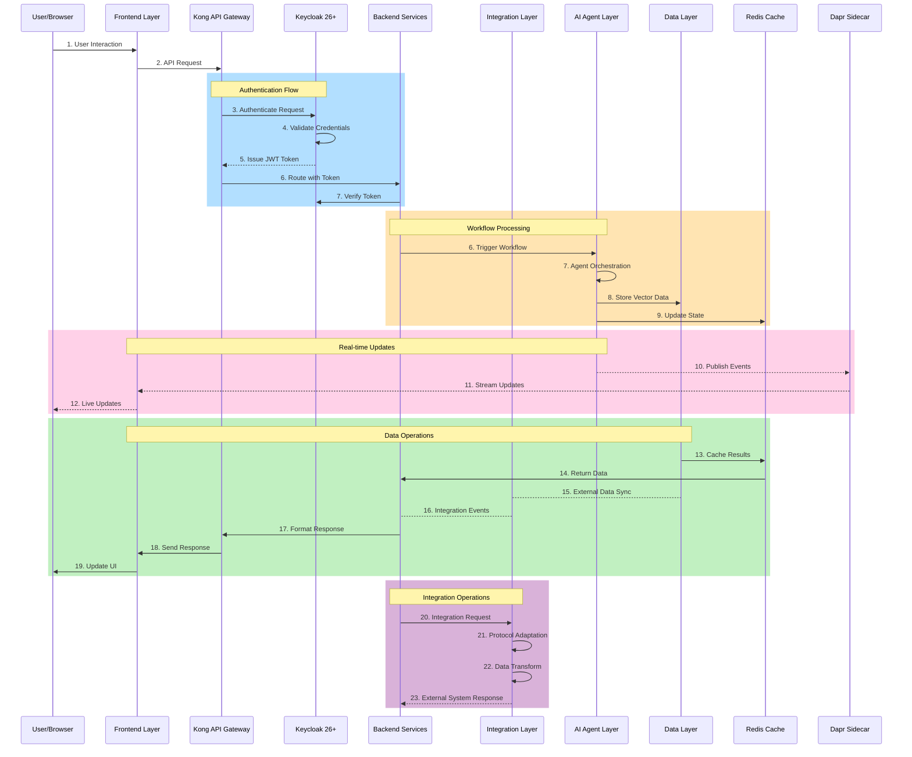
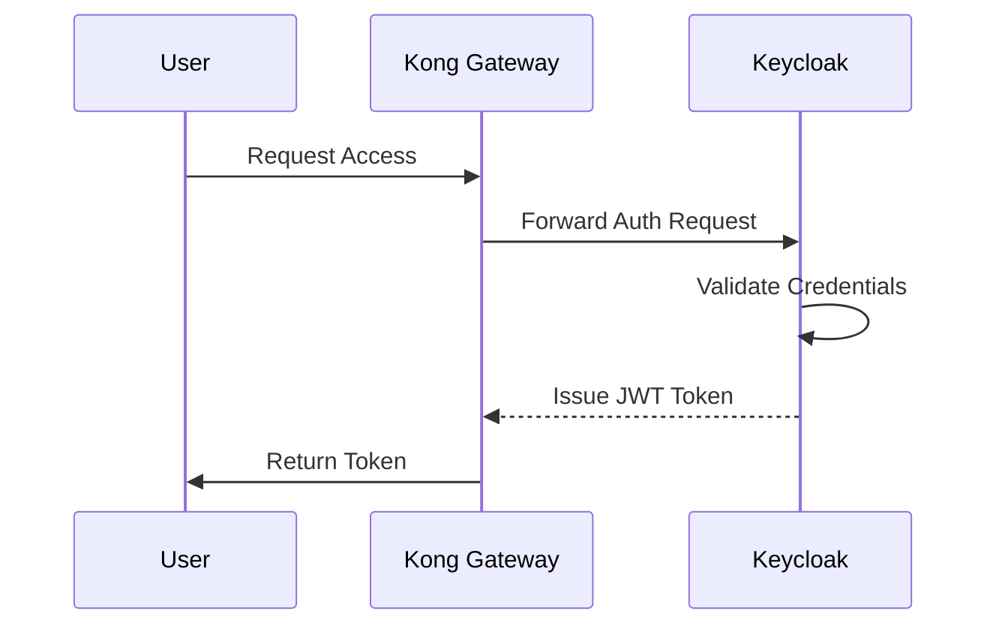
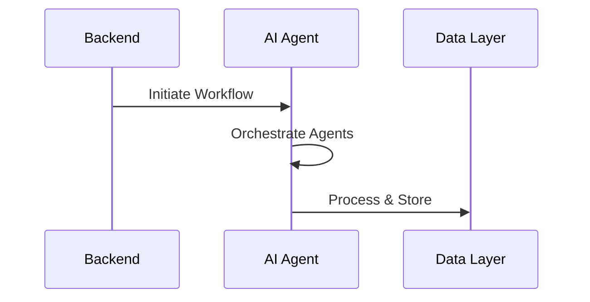
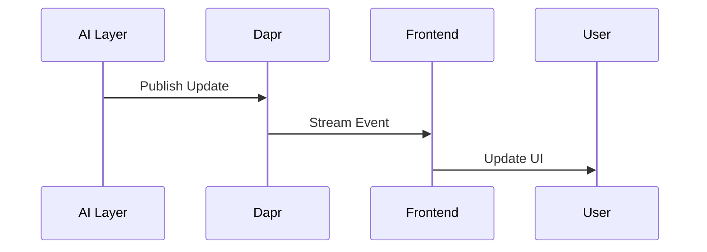
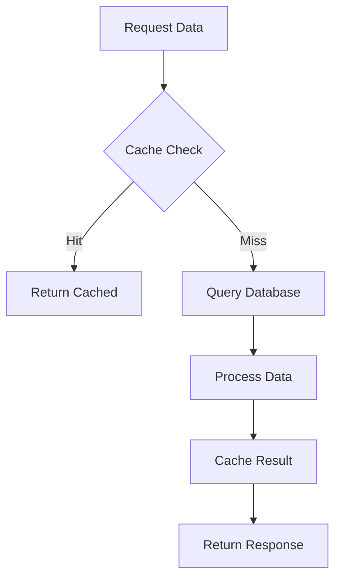
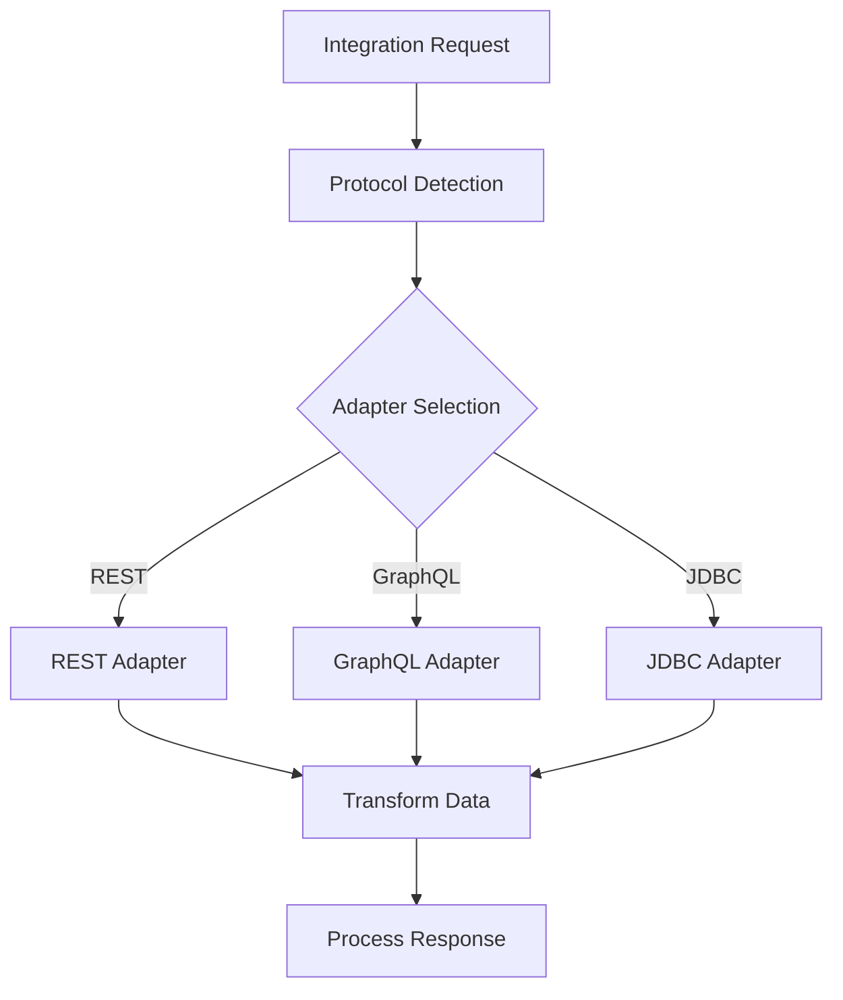
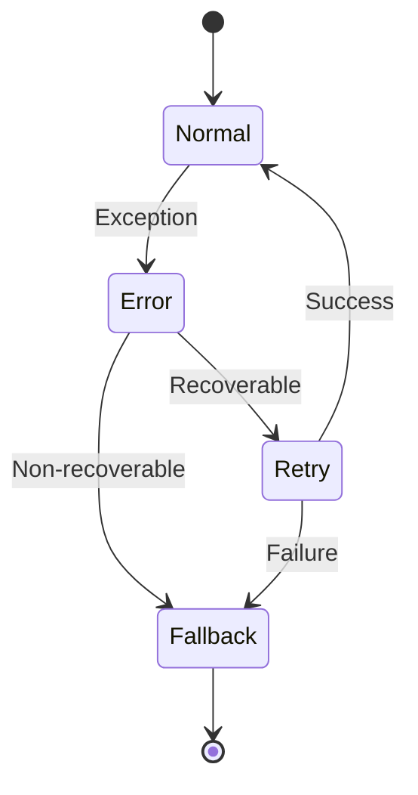
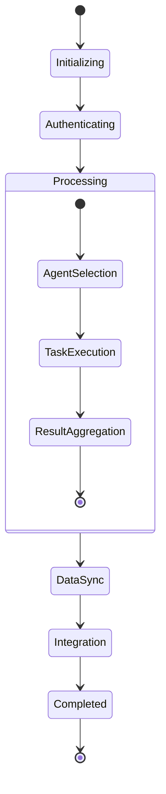

# Application Flow Documentation

## Table of Contents
1. [Overview](#overview)
2. [Core Flow Diagram](#core-flow-diagram)
3. [Authentication Flow](#authentication-flow)
4. [Workflow Processing](#workflow-processing)
5. [Real-time Updates](#real-time-updates)
6. [Data Operations](#data-operations)
7. [Integration Operations](#integration-operations)
8. [Error Handling & Recovery](#error-handling--recovery)
9. [State Management](#state-management)

## Overview

This document details the complete application flow of our enterprise SaaS platform, illustrating how different components interact across various operations. For detailed:
- Architecture specifications, see [layers.md](layers.md)
- Implementation details, see [IMPLEMENTATION.md](IMPLEMENTATION.md)
- Setup instructions, see [README.md](README.md)

## Core Flow Diagram

The following diagram illustrates the complete system interaction flow:

## Authentication Flow

Detailed authentication process using Keycloak:

Key Components:
1. Initial authentication request
2. Credential validation
3. Token generation and distribution
4. Session management
5. Token refresh mechanism

## Workflow Processing

AI workflow orchestration flow:

Processing Steps:
1. Workflow initiation
2. Agent selection and orchestration
3. Task distribution
4. Result aggregation
5. State persistence

## Real-time Updates

Event streaming and real-time notification flow:

Update Mechanisms:
1. Event publication
2. WebSocket streaming
3. UI state management
4. Real-time UI updates
5. Event acknowledgment

## Data Operations

State management and data flow:

Operation Types:
1. Cache management
2. Database operations
3. Data transformation
4. State synchronization
5. Consistency checks

## Integration Operations

External system integration flow:

Integration Points:
1. Protocol adaptation
2. Data transformation
3. Error handling
4. Retry mechanisms
5. Response processing

## Error Handling & Recovery

Error management flow:

Error Scenarios:
1. Authentication failures
2. Network issues
3. Data inconsistencies
4. Integration failures
5. System overload

## State Management

System state transitions:

State Handling:
1. State initialization
2. Transition management
3. State persistence
4. Recovery points
5. Cleanup procedures

For detailed implementation specifics of each flow, refer to [IMPLEMENTATION.md](IMPLEMENTATION.md).
For architecture and compliance details, see [layers.md](layers.md).
