# Enterprise Application Architecture & Standards

## Table of Contents
1. [Architectural Layers](#architectural-layers)
2. [Compliance & Standards](#compliance--standards)
3. [Cross-Cutting Concerns](#cross-cutting-concerns)

## Architectural Layers

### 1. Presentation Layer
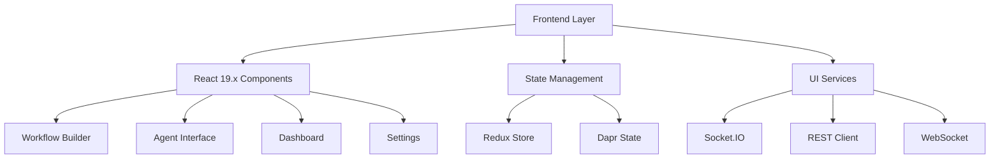

Key Responsibilities:
- User interface and experience
- State management
- Real-time updates
- Workflow visualization
- Component reusability
- Accessibility compliance

### 2. API Gateway Layer
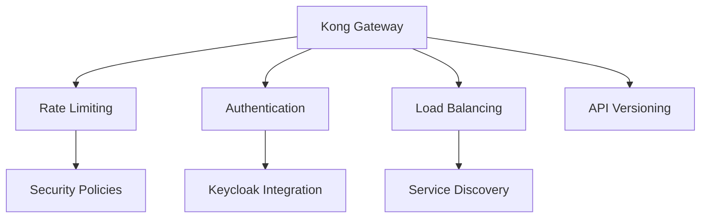

Key Responsibilities:
- Request routing
- Rate limiting
- Authentication
- Load balancing
- API versioning
- Traffic management

### 3. Application Services Layer
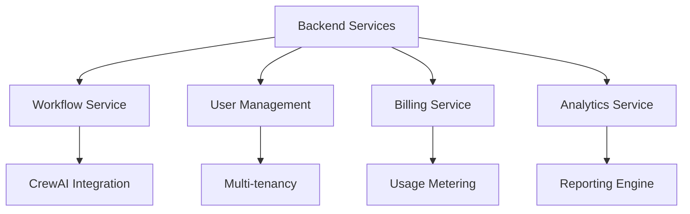

Key Responsibilities:
- Business logic
- Service orchestration
- Data processing
- Event handling
- Transaction management
- Error handling

### 4. AI/ML Layer
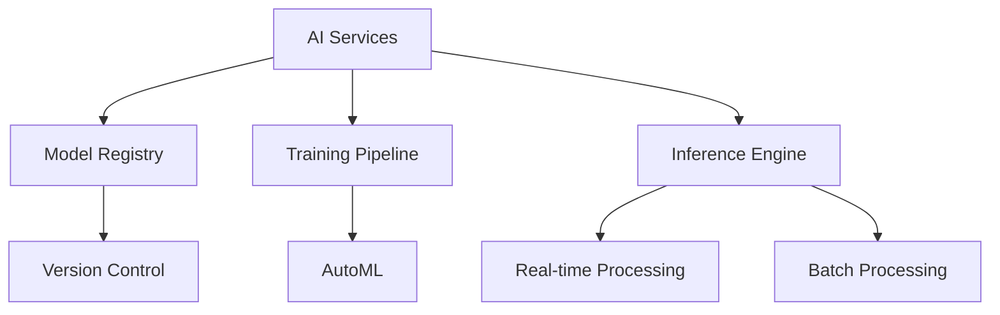

Key Responsibilities:
- Model management
- Training orchestration
- Inference serving
- Performance monitoring
- Resource optimization
- Model versioning

### 5. Data Layer
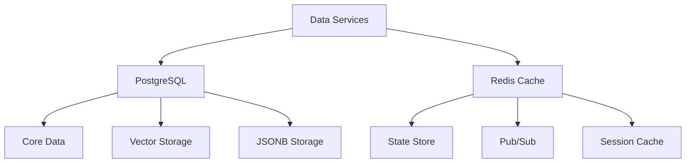

Key Responsibilities:
- Data persistence
- Caching
- State management
- Event streaming
- Data validation
- Backup/recovery

### 6. Integration Layer
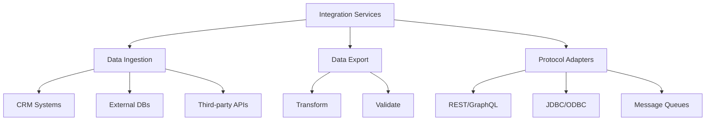

Key Responsibilities:
- External system integration
- Protocol adaptation
- Data transformation
- Error handling
- Monitoring
- Security

### 7. Security Layer (Keycloak)
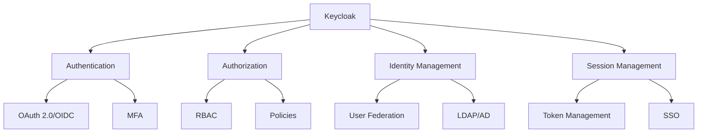

Key Responsibilities:
- Authentication
- Authorization
- Identity management
- Access control
- Token management
- Federation

## Compliance & Standards

### Healthcare Standards
#### 1. HIPAA
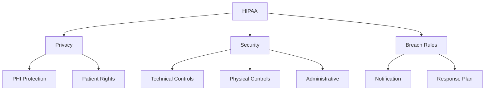

Requirements:
- Data encryption (at rest/transit)
- Access logging
- Role-based access
- Breach notification
- Business agreements

#### 2. HITECH
- Electronic health records security
- Technology implementation
- Breach protocols
- Patient data access

#### 3. HL7 FHIR
- Healthcare data exchange
- RESTful implementation
- Resource modeling
- Interoperability

### Financial Standards
#### 1. SOX
- Audit trails
- Data integrity
- Access management
- Change control

#### 2. PCI DSS
- Payment security
- Data encryption
- Security assessment
- Network security

#### 3. Basel III
- Risk aggregation
- Reporting
- Data validation
- Regulatory compliance

### Data Privacy Standards
#### 1. GDPR
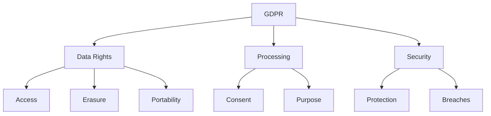

Requirements:
- Data minimization
- Privacy by design
- Right to be forgotten
- Consent management
- Cross-border transfers

#### 2. CCPA & PIPEDA
- Consumer rights
- Data inventory
- Privacy notices
- Consent management

### Security Standards
#### 1. ISO 27001
- Information security
- Risk assessment
- Security controls
- Compliance monitoring

#### 2. NIST Framework
- Identity management
- Access control
- Data protection
- Incident response

#### 3. SOC 2
- Security controls
- Availability
- Confidentiality
- Privacy

## Cross-Cutting Concerns

### Technical Controls
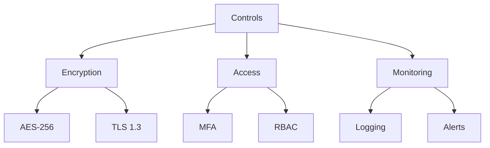

### Administrative Controls
- Security policies
- Procedures
- Training
- Audits
- Reviews

### Monitoring & Observability
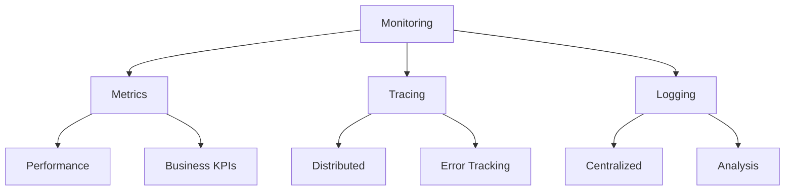

### Scalability & Performance
- Horizontal scaling
- Load balancing
- Caching strategy
- Database sharding
- Resource optimization

### Disaster Recovery
- Backup procedures
- Recovery testing
- Business continuity
- Incident response
- Data replication

### Data Governance
- Data classification
- Retention policies
- Access controls
- Audit logging
- Compliance monitoring

For implementation details, see [IMPLEMENTATION.md](IMPLEMENTATION.md).
