# Enterprise SaaS Application Architecture Layers

## Table of Contents
1. [Presentation Layer](#presentation-layer)
2. [API Gateway Layer](#api-gateway-layer)
3. [Application Services Layer](#application-services-layer)
4. [AI/ML Layer](#aiml-layer)
5. [Data Layer](#data-layer)
6. [Integration Layer](#integration-layer)
7. [Security Layer](#security-layer)
8. [Compliance & Standards](#compliance--standards)

## Presentation Layer
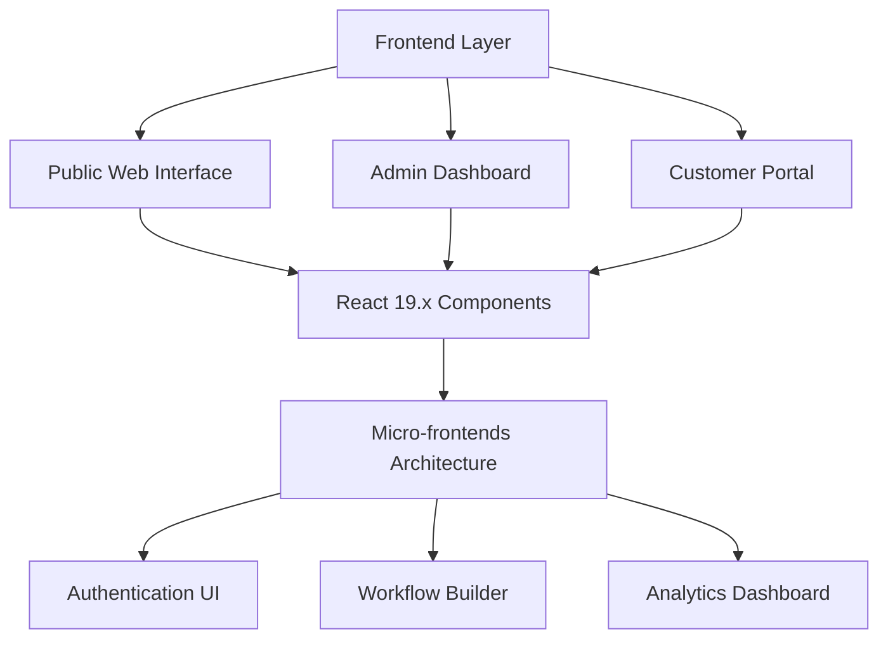

### Implementation Details
- React 19.x for component architecture
- Micro-frontends for scalable UI development
- Real-time updates via WebSocket/Socket.IO
- Responsive design for multi-device support
- Accessibility compliance (WCAG 2.1)
- Internationalization support

## API Gateway Layer
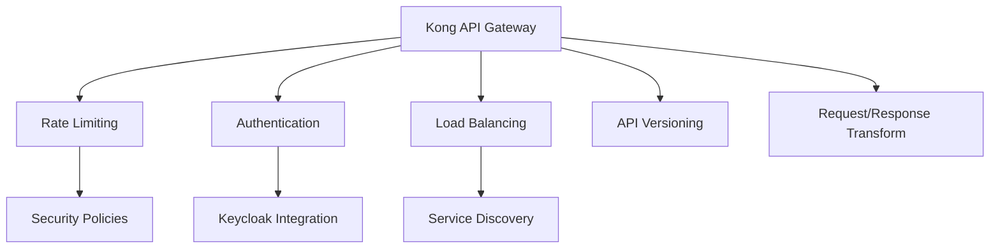

### Implementation Details
- Kong 3.9.0 for API management
- Request/response transformation
- Traffic control and rate limiting
- SSL/TLS termination
- API analytics and monitoring
- Service mesh integration

## Application Services Layer
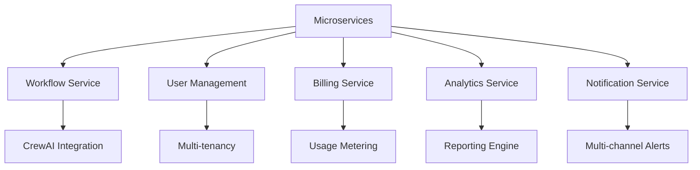

### Implementation Details
- Microservices architecture
- Event-driven design
- Domain-driven design patterns
- Circuit breaker patterns
- Retry mechanisms
- Fault tolerance

## AI/ML Layer
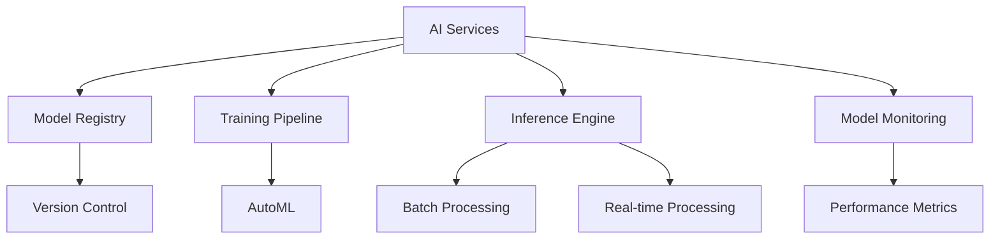

### Implementation Details
- CrewAI 0.102.0 for orchestration
- Model versioning and registry
- Automated training pipelines
- A/B testing framework
- Model performance monitoring
- Resource optimization

## Data Layer
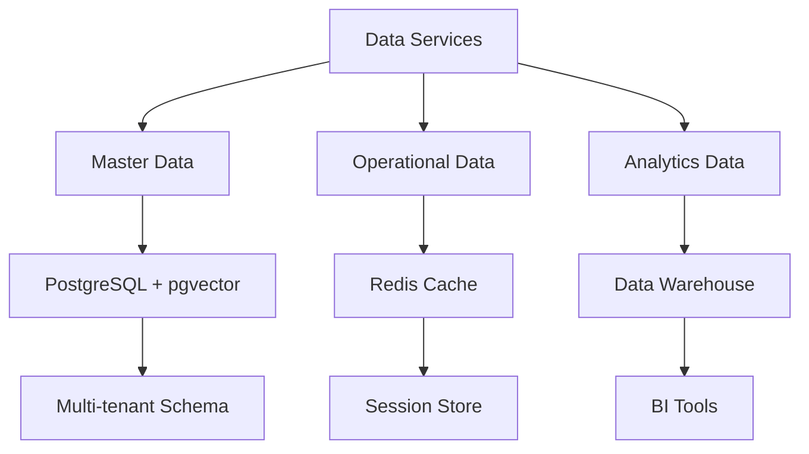

### Implementation Details
- PostgreSQL 17.0 with pgvector
- Redis 7.4 for caching
- Data partitioning strategies
- Backup and recovery procedures
- Data lifecycle management
- Archive and retention policies

## Integration Layer
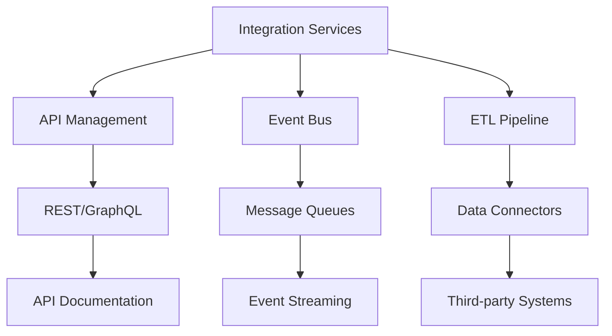

### Implementation Details
- REST/GraphQL APIs
- Message queue integration
- ETL processes
- Third-party system connectors
- Data transformation
- Protocol adaptation

## Security Layer
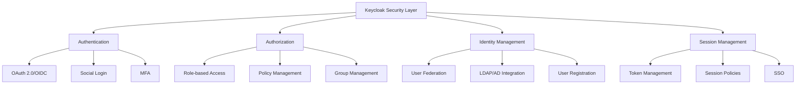

### Implementation Details
- Keycloak 26+ integration
- OAuth 2.0 and OpenID Connect
- Multi-factor authentication
- Single sign-on (SSO)
- Role-based access control
- User federation
- Token management
- Session policies

## Compliance & Standards
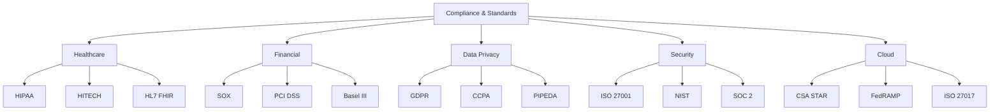

### Standards Implementation

#### Healthcare Standards
1. **HIPAA Compliance**
   - Encryption at rest and in transit
   - Audit logging for PHI access
   - Role-based access control
   - Business Associate Agreements
   - Security incident procedures

2. **HITECH Requirements**
   - Electronic health record security
   - Breach notification protocols
   - Patient data access controls
   - Security technology implementation

3. **HL7 FHIR Integration**
   - Standardized healthcare data exchange
   - RESTful API implementation
   - Resource-based data modeling
   - Interoperability standards

#### Financial Standards
1. **SOX Compliance**
   - Audit trail implementation
   - Financial data integrity
   - Access control documentation
   - Change management procedures

2. **PCI DSS Requirements**
   - Secure payment processing
   - Card data encryption
   - Regular security assessments
   - Network segmentation

3. **Basel III Framework**
   - Risk data aggregation
   - Risk reporting capabilities
   - Data accuracy validation
   - Regulatory reporting

#### Data Privacy Standards
1. **GDPR Implementation**
   - Data minimization
   - Privacy by design
   - Right to be forgotten
   - Data portability
   - Consent management
   - Cross-border data transfer

2. **CCPA Compliance**
   - Consumer data rights
   - Opt-out mechanisms
   - Data inventory
   - Privacy notices
   - Data subject requests

3. **PIPEDA Requirements**
   - Consent management
   - Data collection limitations
   - Transparency requirements
   - Privacy impact assessments

### Technical Controls Implementation
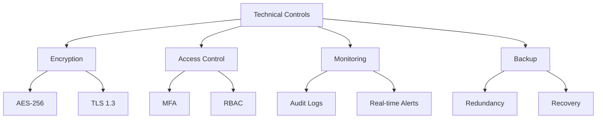

### Administrative Controls
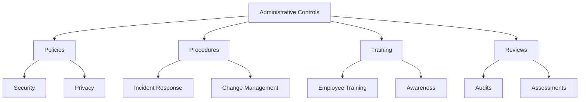

### Physical Controls
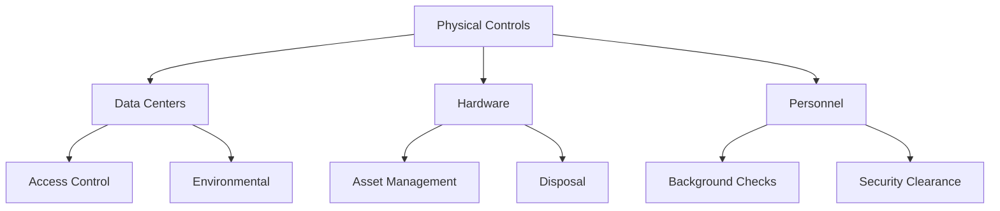

## Implementation Guidelines

### Development Standards
- Clean code principles
- Test-driven development
- Continuous integration/deployment
- Code review processes
- Documentation requirements

### Security Practices
- Zero-trust architecture
- Regular security audits
- Penetration testing
- Vulnerability assessments
- Security training

### Monitoring & Operations
- 24/7 system monitoring
- Incident response procedures
- Capacity planning
- Performance optimization
- Disaster recovery

### Scalability Strategy
- Horizontal scaling
- Load balancing
- Database sharding
- Caching strategies
- Resource optimization

### Maintenance Procedures
- Regular updates
- Security patches
- Performance tuning
- Backup verification
- System health checks
