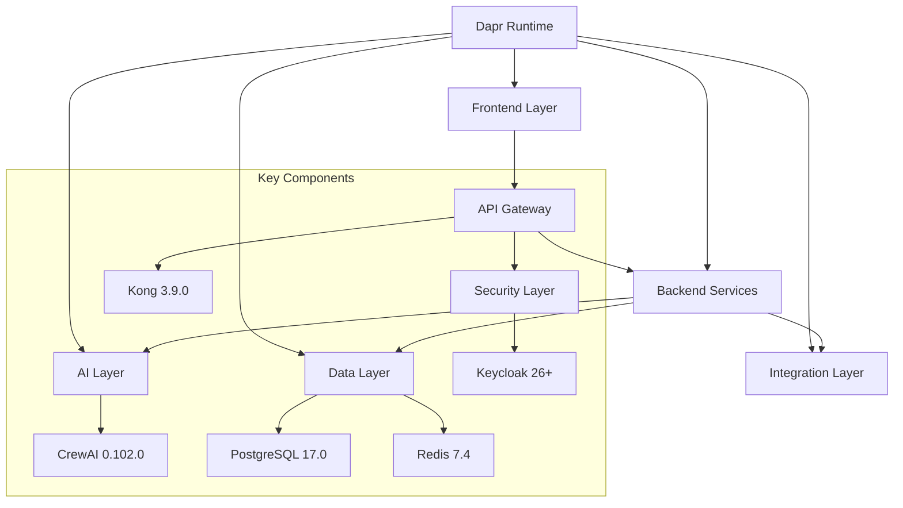

# AI-Powered Workflow Automation Platform

A modular, scalable platform for enterprise workflow automation using AI agents. Built with the latest stable SDKs, libraries, and permissive licensing (MIT/Apache 2.0).

## Documentation Structure
- **[readme.md](readme.md)**: Project overview and quick start guide
- **[architecture-layers.md](architecture-layers.md)**: Detailed architecture and compliance standards
- **[implementation-guide.md](implementation-guide.md)**: Technical implementation details
- **[application-flow.md](application-flow.md)**: Detailed system interaction flows and processes
- **[directory-structure.md](directory-structure.md)**: Complete project structure and organization

## Key Features
- No-code workflow builder with ReactFlow
- Real-time AI response streaming
- Multi-LLM orchestration
- Enterprise-grade security & compliance
- Distributed application runtime with Dapr

## Basic Architecture


For detailed architecture, see [architecture-layers.md](architecture-layers.md).

## Prerequisites
- Docker 25.0.2
- Docker Compose 2.33.0
- Python 3.12.2
- Node.js 22.x
- Dapr CLI 1.14
- Keycloak 26+

## Quick Start

1. **Clone Repository**
```bash
git clone https://github.com/your-org/workflow-platform.git
cd workflow-platform
```

2. **Configure Environment**
```bash
# Database settings
export POSTGRES_USER=dbuser
export POSTGRES_PASSWORD=dbpassword
export POSTGRES_DB=workflow_automation

# Redis settings
export REDIS_PASSWORD=redispassword
export REDIS_PORT=6379

# Keycloak settings
export KEYCLOAK_ADMIN=admin
export KEYCLOAK_ADMIN_PASSWORD=admin
export KEYCLOAK_URL=http://localhost:8080
export KEYCLOAK_REALM=workflow-platform
export KEYCLOAK_CLIENT_ID=workflow-client
export KEYCLOAK_CLIENT_SECRET=your-client-secret
```

3. **Setup AI Agents**
```bash
cd platform/ai_agents
cp .env.example .env
# Configure OpenAI API key and other settings
```

4. **Start Services**
```bash
cd ../
docker-compose up -d
```

## Service Access Points

| Service | URL | Credentials |
|---------|-----|-------------|
| Frontend UI | http://localhost:3001 | - |
| AI Agents API | http://localhost:9000 | - |
| Kong Admin | http://localhost:8001 | - |
| Konga Dashboard | http://localhost:1337 | - |
| Keycloak Admin | http://localhost:8080 | admin/admin |
| Grafana | http://localhost:3000 | admin/admin |
| Prometheus | http://localhost:9090 | - |
| PostgreSQL | localhost:5433 | See env vars |
| Redis | localhost:6379 | See env vars |

For detailed setup instructions and configurations, see [implementation-guide.md](implementation-guide.md).

## Contributing
1. Fork the repository
2. Create a feature branch
3. Follow coding standards (see [implementation-guide.md](implementation-guide.md))
4. Submit pull request with comprehensive description
5. Ensure all tests pass and documentation is updated

## License
This project is dual-licensed under:
- MIT License
- Apache License 2.0

© 2024 netstratum. All rights reserved.
